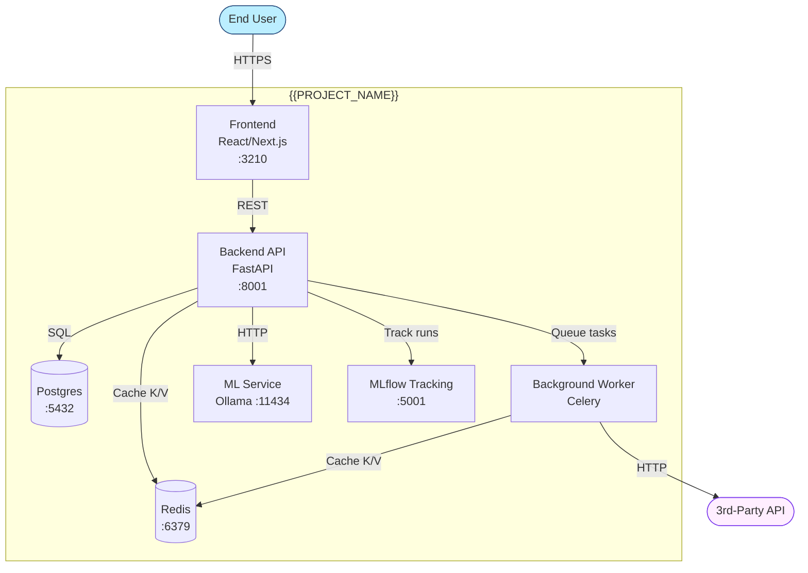

# Architecture · {{PROJECT_NAME}}

> Per §47.2 C4 model. L1 Context · L2 Containers. Update on every architectural change.

## L1 — System Context

External actors and the system as a single box.

```mermaid
graph TB
    User([End User]):::actor
    Admin([Admin]):::actor
    Vendor([3rd-Party API]):::external
    Regulator([Regulator/Auditor]):::external

    System[{{PROJECT_NAME}}<br/>AI-Powered Platform]:::system

    User -->|HTTPS| System
    Admin -->|Authenticated UI| System
    System -->|OAuth2/REST| Vendor
    System -->|Audit logs| Regulator

    classDef actor fill:#bef,stroke:#2c5282
    classDef external fill:#fef,stroke:#7c3aed
    classDef system fill:#1e40af,color:#fff,stroke:#1e3a8a,stroke-width:3px
```

## L2 — Containers

Services and their relationships within the system boundary.



## Component descriptions

| Component | Tech | Purpose | Owner |
|---|---|---|---|
| Frontend | React + Vite | User interface | {{TEAM}} |
| Backend API | FastAPI | Business logic + ML serving | {{TEAM}} |
| Postgres | PostgreSQL 16 | Primary data store | {{TEAM}} |
| Redis | Redis 7 | Cache + task queue broker | {{TEAM}} |
| Worker | Celery | Background tasks | {{TEAM}} |
| ML Service | Ollama | LLM inference | {{TEAM}} |
| MLflow | MLflow 2.x | Experiment tracking | {{TEAM}} |

## Architectural decisions (link to ADRs)

- ADR-001: {{KEY_DECISION_1}}
- ADR-002: {{KEY_DECISION_2}}

## Composes with

§47 (C4 model + design patterns) · §80 (agentic 13-phase if applicable) · §86 (this standard).
