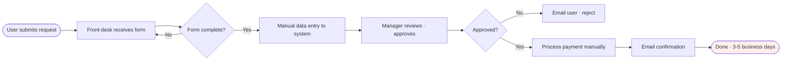
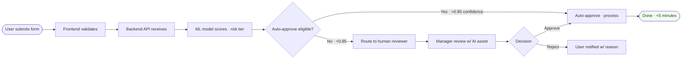

# Flow Diagram · {{PROJECT_NAME}} · Manual vs Automatic

> Per §64.27. For each major business process: manual AS-IS swimlane + automatic TO-BE flow + comparison table.

## Process 1: {{PROCESS_NAME}}

### Manual flow (AS-IS)

### Automatic flow (TO-BE)

### Comparison table

| Metric | Manual (AS-IS) | Automatic (TO-BE) | Improvement |
|---|---|---|---|
| Time per instance | 3-5 days | < 5 min | 800-1500x |
| Error rate | 8-12% | 1-2% (auto) · 4-6% (HITL) | 4-6x |
| Cost per instance | $25-40 | $0.05-0.15 | 200x |
| Human touch points | 4-6 | 0-2 | 3x reduction |
| Throughput | 50/day/agent | 10,000/day total | 200x |

## Process 2: {{ADDITIONAL_PROCESS}}

[Repeat above structure for each major business process]

## Composes with

§64.27 (Manual/Automatic flow standard) · §74 (lifecycle Phase 4 use-case definition) · §86 (this standard).
