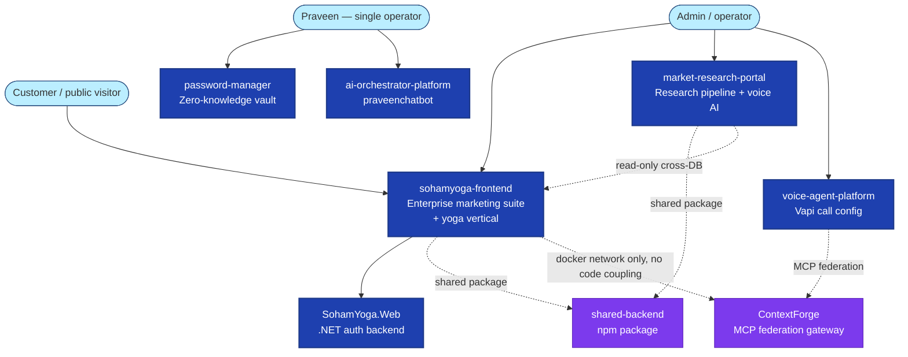

# Master C4 Model — Repository-Wide

System Landscape and Container views across all 6 real portals, synthesized from Phase 1/7
investigation. Verified 2026-09-08.

## L0 — System Landscape

## Real cross-portal coupling (not aspirational — each edge below is grep/file-confirmed)

| Edge | Type | Evidence |
|---|---|---|
| market-research-portal → sohamyoga (Postgres) | Read-only cross-DB (`sohamyoga_ro` role, GRANT SELECT only, verified live: INSERT/CREATE denied) | `PricingCrossPortalJob.ts`, `ReviewsCrossPortalJob.ts` |
| sohamyoga-frontend + market-research-portal → `@sohamyoga/shared-backend` | Shared npm package (OllamaClient w/ circuit breaker, `withApiErrorLog`) | `packages/shared-backend/package.json` consumers |
| voice-agent-platform → sohamyoga-network (Docker) | Network-level only, for ContextForge MCP reachability — **not a code dependency** | `voice-agent-platform/docker-compose.yml` comment |
| voice-agent-platform ↔ ContextForge | MCP federation (IBM ContextForge, pinned digest, on shared network, loopback-bound) | `deploy/contextforge/README.md`, `voice-agent-platform/src/app/api/mcp/route.ts` |
| sohamyoga-frontend ↔ SohamYoga.Web (.NET) | HTTP, cookie-forwarded auth (`/api/auth/me`, `/api/customer/auth/me`) — **two fully separate databases** (Postgres 496 tables vs. SQLite) | Reality Matrix |
| ai-orchestrator-platform → agentic-ollama-platform | In-process import via `bridge.py` sys.path hack — reuses engine rather than reimplementing | `backend/app/bridge.py` |
| password-manager | **No coupling to any other portal** — fully standalone, own Postgres DB, own auth | Reality Matrix |

## L1 — Container view (representative: sohamyoga-frontend + SohamYoga.Web, the largest pair)

See [sohamyoga-frontend/C4.md](sohamyoga-frontend/C4.md) for the detailed L1-L3 view of this pair —
not duplicated here. This document adds the system-landscape layer that file doesn't cover.

## What ContextForge actually is (real, not aspirational)

A real, deployed IBM ContextForge instance (pinned image digest, not `latest`-floating) runs as an
MCP federation control plane on the shared Docker network. Per its own README: authentication is
mandatory, public/basic-auth/query-string credentials are disabled, and — importantly — its own
documentation explicitly states **"the current `/api/mcp/social` route is an application HTTP
facade, not a protocol-compliant upstream MCP server"** — i.e., not everything that looks
MCP-related in this repo is actually federated through ContextForge yet. This matches the Phase 1
finding that only 2-3 of 29 registered MCP tools in sohamyoga-frontend's own gateway have real
working implementations.
