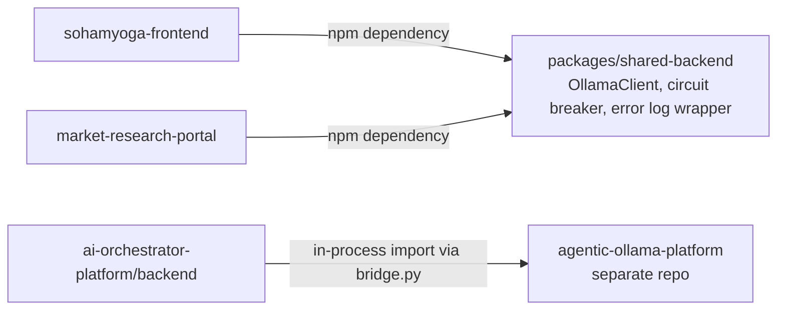

# Master Dependency Map — Repository-Wide

Verified 2026-09-08. Complements [MASTER_C4.md](MASTER_C4.md)'s coupling table with the reverse
view: what each portal depends on, and — critically — what it does NOT share with the others.

## Database ownership (no shared superuser credential anywhere)

| Portal | Database | Tables | Shared with |
|---|---|---|---|
| sohamyoga-frontend | Postgres `sohamyoga` (port 5437) | 496 | market-research-portal, **read-only** via `sohamyoga_ro` role |
| market-research-portal | Postgres `market_research_portal` (same instance, port 5437, separate DB) | 78 | nobody writes into it cross-portal |
| SohamYoga.Web (.NET) | **SQLite**, own file (`/app/data/sohamyoga.db`) | not counted (EF Core managed) | nobody — confirmed zero Npgsql references, fully isolated from the Postgres instance despite the similar name |
| voice-agent-platform | Postgres `voiceagent-postgres` (own container, port 5438) | 17 | nobody |
| password-manager | Postgres `passwordmanager-postgres` (own container, port 5439) | 3 (`app_user`, `vault_item`, `app_session`) | nobody |
| ai-orchestrator-platform | SQLite (`backend/data/orchestrator.db`) | not counted | nobody |

**Architectural observation:** despite 4 separate Postgres instances/databases plus 2 SQLite files
existing in one workspace, there is exactly **one** cross-database read path in the entire repo
(market-research-portal → sohamyoga, read-only, role-enforced) — everything else is fully isolated.
This is a genuinely defensible pattern (blast-radius containment per app) at the cost of duplicated
schema-design effort and no single source of truth for cross-cutting concerns like "all customers
across all apps."

## Package/library dependency graph (real, not inferred)

No portal imports another portal's application code directly (no `voice-agent-platform` importing
from `sohamyoga-frontend`, etc.) — the only real code-sharing is the one `shared-backend` npm
package and `ai-orchestrator-platform`'s reuse of `agentic-ollama-platform`'s engine.

## External vendor dependency concentration

| Vendor/Service | Portals depending on it | Single point of failure? |
|---|---|---|
| Ollama (local LLM) | sohamyoga-frontend, market-research-portal, ai-orchestrator-platform (as one of 6 providers) | Yes for the first two — both fail closed (not fabricate) when Ollama is unreachable, per Phase 1 findings |
| OpenBao vault | ai-orchestrator-platform, sohamyoga-frontend (Skyvern creds) | Yes, and already materialized as a real incident this audit (dev-mode, secrets lost on restart) |
| Postiz (self-hosted social scheduler) | sohamyoga-frontend | Yes — 6+ social modules (Facebook/LinkedIn/YouTube/Telegram management) gated on Postiz being deployed with a valid API key, which it currently isn't |
| Vapi (voice AI) | voice-agent-platform | Yes — entire "voice AI" business function depends on one vendor; per Phase 1, actual call placement has never been exercised despite the integration existing |
| Skyvern (browser automation) | sohamyoga-frontend | Confirmed running, used for platform-setup test-connections |
| ContextForge (IBM, MCP federation) | voice-agent-platform (registered), sohamyoga-frontend (network-adjacent, not yet federated per its own docs) | Not yet a hard dependency — still early |

## What this document does not cover

A full transitive npm/pip dependency tree (thousands of packages) is not reproduced here — see
[SECURITY_RISK_REGISTER.md](../security/SECURITY_RISK_REGISTER.md) for the vulnerability-relevant
subset (SCA scan results). This document covers *architectural* dependencies (what a human/AI
architect needs to reason about blast radius and coupling), not the full package graph.
