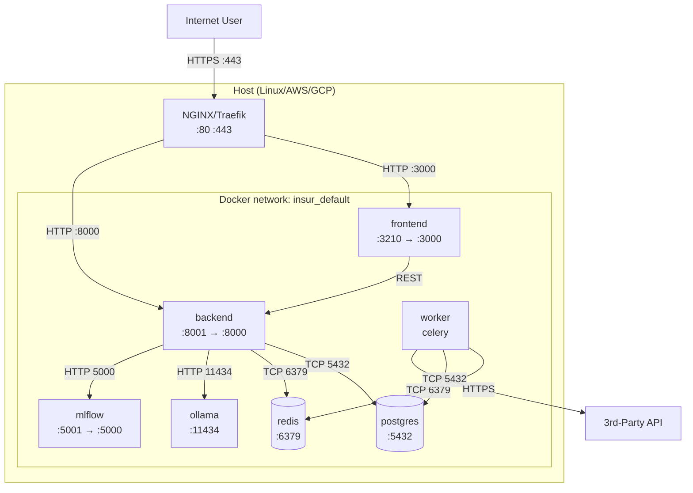
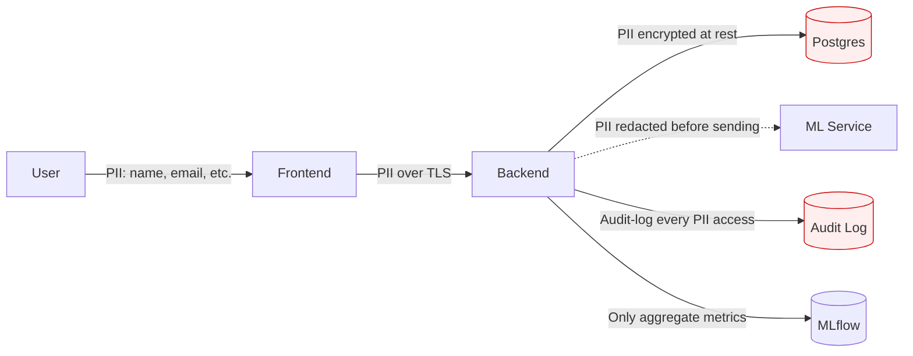

# Network Flow · {{PROJECT_NAME}} · Deployment Topology

> Container topology + port map + service-to-service connections + external integrations + data-flow boundaries.

## Container topology

## Port map (host:container)

| Service | Host port | Container port | Purpose |
|---|---|---|---|
| Frontend (Vite) | 3210 | 3000 | UI |
| Backend (FastAPI) | 8001 | 8000 | REST API |
| Postgres | 5432 | 5432 | Primary DB |
| Redis | 6379 | 6379 | Cache + queue |
| Ollama | 11434 | 11434 | LLM inference |
| MLflow | 5001 | 5000 | Experiment tracking |
| Reverse proxy | 80, 443 | 80, 443 | Public entrypoint |

## Service-to-service connections

| From | To | Protocol | Auth | Encryption |
|---|---|---|---|---|
| Frontend | Backend | HTTP/REST | Bearer token | TLS (prod) · plain (dev) |
| Backend | Postgres | TCP/SQL | Username+pwd in env | TLS optional |
| Backend | Redis | TCP/RESP | AUTH password | None (private net) |
| Backend | Ollama | HTTP | None (private) | None |
| Backend | MLflow | HTTP | None | None |
| Worker | Postgres | TCP/SQL | Same as backend | Same |
| Worker | Redis | TCP/RESP | Same as backend | Same |
| Worker | 3rd-party | HTTPS | OAuth2/API key | TLS |

## External integrations

| External | Purpose | Auth | Data sensitivity |
|---|---|---|---|
| Stripe / payment | Billing | API key | PCI-DSS scope |
| SendGrid / email | Notifications | API key | PII (email addresses) |
| 3rd-party AI | Optional model | OAuth2 | Prompt content (redacted) |
| OAuth provider | User login | OAuth2 client | User PII |

## Data-flow boundaries (where PII enters/exits)

## Failure / DR considerations

- **Postgres**: primary + read replica · daily backup to S3 · RPO 1h
- **Redis**: AOF persistence · RPO 1s
- **Backend**: stateless · horizontal scaling
- **Frontend**: CDN-cached static · zero state
- **Worker**: idempotent tasks · retry on failure

## Composes with

§47 (architecture · network is a C4 deployment view) · §76 (privacy · data-flow boundaries) · §86 (this standard).
