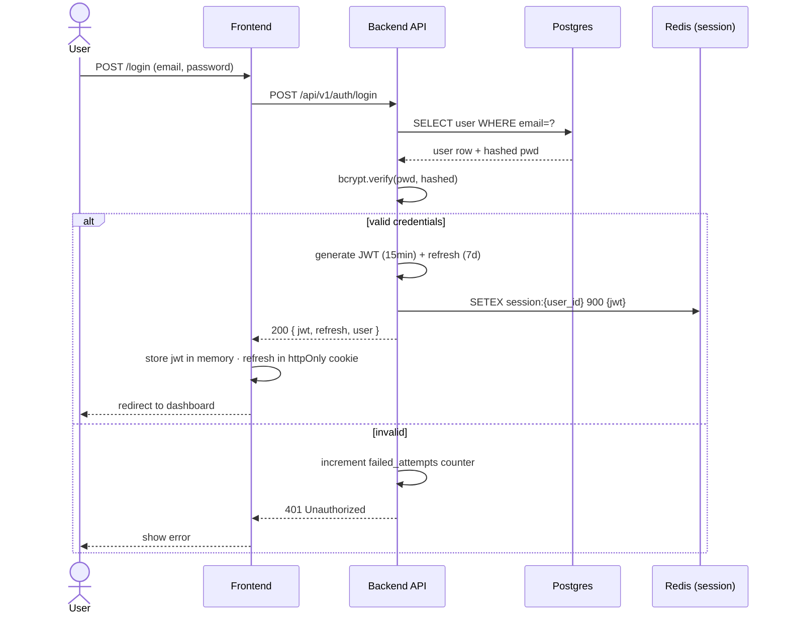
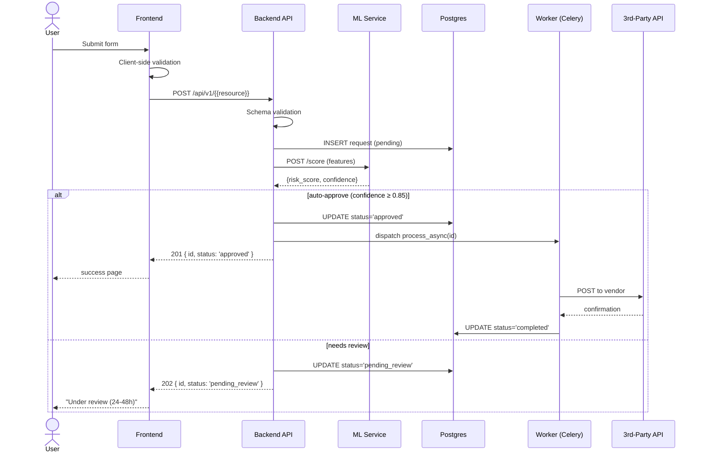
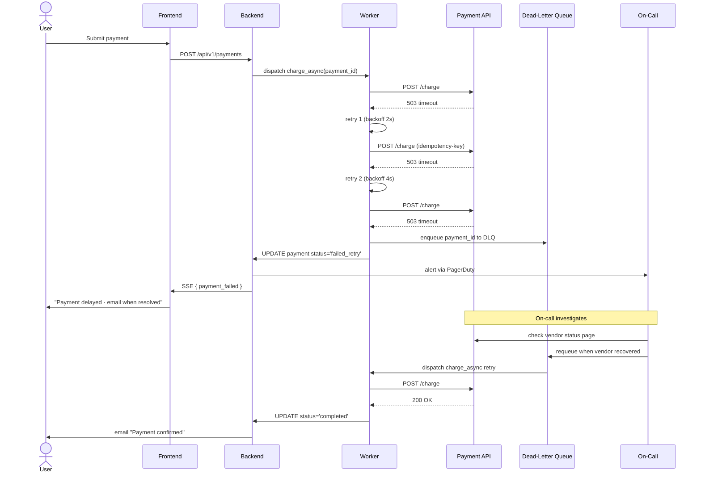

# Sequence Diagrams · {{PROJECT_NAME}} · Top 3 User Flows

> Per §86 doc #5. Top 3 user flows: authentication · primary business flow · error recovery. Mermaid `sequenceDiagram` syntax.

## Flow 1: Authentication / Login

## Flow 2: Primary business flow — {{BUSINESS_FLOW_NAME}}

## Flow 3: Error recovery — payment failure / external API failure

## Composes with

§47 (architecture · sequences are C4 dynamic views) · §57.5 (5-question runbook · flow #3 IS incident response) · §73 (two-menu layout · flows describe its routes) · §86 (this standard).
