# C4 Level 1 — System Context: sohamyoga Digital Marketing Platform

**Verified:** 2026-09-15 — grounded in direct code reads of `docker-compose.yml`,
`src/lib/`, `src/domain/social/db-schema.sql`, `MASTER_INTEGRATION_MAP.md`.

## System Context Diagram

```mermaid
graph TB
    Admin([Platform Admin\nManages content, campaigns,\naffiliate, social accounts]):::actor
    Customer([Customer / Yogapreneur\nPosts content, tracks performance,\nmanages affiliate links]):::actor
    Developer([Developer\nConfigures credentials,\nmonitors API health]):::actor

    sohamyoga[sohamyoga Platform\nEnterprise digital-marketing suite\n221 pages · 383 API routes · 93 cron jobs\nSocial publishing · Affiliate · AI automation\nCRM · Analytics · E-commerce · Surveys]:::system

    Postiz([Postiz\nSelf-hosted social scheduler\n12 platforms via Postiz adapter]):::external
    Ollama([Ollama local\nLLM inference\nqwen2.5 default model]):::external
    SohamYogaNet([SohamYoga.Web\n.NET auth backend\ncookie-forwarded session]):::external
    GoogleBusiness([Google Business Profile API\nReviews · Local posts]):::external
    Skyvern([Skyvern\nSelf-hosted browser automation\n127.0.0.1:18000]):::external
    OpenBao([OpenBao secrets vault\nRuntime credential fetch\nDev-mode — ephemeral]):::external
    GoogleDrive([Google Drive API\nOAuth-based file ingestion]):::external
    SlackAPI([Slack API\nBearer-token REST\nChannel content ingestion]):::external
    TelegramAPI([Telegram Bot API\nDirect first-wave publish]):::external
    DiscordAPI([Discord Webhook API\nDirect first-wave publish]):::external
    MastodonAPI([Mastodon API v1\nDirect first-wave publish]):::external
    BlueskyAPI([Bluesky AT Protocol\nDirect first-wave publish]):::external
    GitHubAPI([GitHub API\nRelease monitoring\nRepo scout]):::external
    TrustpilotAPI([Trustpilot API\nReview sync]):::external
    PinterestAPI([Pinterest API v5\nPin analytics sync]):::external
    VimeoAPI([Vimeo API\nVideo stats sync]):::external
    PatreonAPI([Patreon API\nPost stats sync]):::external
    n8n([n8n local\nParallel automation\nInstagram/Facebook/Reviews/YouTube]):::external
    TalentsHill([TalentsHill\nSeparate Next.js portal\nShares shared-social-platforms package]):::external
    AIOrchestrator([AI Orchestrator\nFastAPI :8100\nLangChain + LangGraph agents]):::internal

    Admin -->|Admin portal /admin/*| sohamyoga
    Customer -->|Customer portal /customer/*| sohamyoga
    Developer -->|Credentials wizard\n/admin/platform-credentials| sohamyoga
    sohamyoga -->|Auth/me — cookie forward| SohamYogaNet
    sohamyoga -->|REST API social publish| Postiz
    sohamyoga -->|Local HTTP :11434| Ollama
    sohamyoga -->|REST :18000| Skyvern
    sohamyoga -->|Runtime secret fetch| OpenBao
    sohamyoga -->|OAuth REST| GoogleDrive
    sohamyoga -->|Bearer token REST| SlackAPI
    sohamyoga -->|mybusinessreviews API| GoogleBusiness
    sohamyoga -->|Bot API direct| TelegramAPI
    sohamyoga -->|Webhook direct| DiscordAPI
    sohamyoga -->|v1/statuses direct| MastodonAPI
    sohamyoga -->|app-password direct| BlueskyAPI
    sohamyoga -->|REST v3| GitHubAPI
    sohamyoga -->|REST reviews| TrustpilotAPI
    sohamyoga -->|v5 analytics| PinterestAPI
    sohamyoga -->|video stats| VimeoAPI
    sohamyoga -->|post stats| PatreonAPI
    sohamyoga <-->|Internal HTTP calls| AIOrchestrator
    n8n -->|Parallel automation| sohamyoga
    TalentsHill -.->|Shared npm package\n@sohamyoga/shared-social-platforms| sohamyoga

    classDef actor fill:#d4e6f1,stroke:#2c5282,color:#1a1a1a
    classDef system fill:#1e40af,color:#ffffff,stroke:#1e3a8a,stroke-width:3px
    classDef external fill:#f3e5f5,stroke:#7c3aed,color:#1a1a1a
    classDef internal fill:#e8f5e9,stroke:#2e7d32,color:#1a1a1a
```

## External Actor Summary

### Human actors

| Actor | Entry point | Auth mechanism |
|---|---|---|
| Platform Admin | `/admin/*` | `getAdminPrincipal()` → .NET `/api/auth/me`; role in `['Admin','Editor','Sales']` |
| Customer / Yogapreneur | `/customer/*` | `getCustomerPrincipal()` → .NET `/api/customer/auth/me`; any authenticated customer |
| Developer | `/admin/platform-credentials` | Same admin auth |

### External systems

| System | Type | Real client code | Current status |
|---|---|---|---|
| Postiz | Self-hosted social scheduler | `PostizSocialAutoPublishJob.ts`, social domain | CODE_EXISTS_NOT_INTEGRATED — `POSTIZ_PUBLIC_API_KEY` unset |
| Ollama | Local LLM (`qwen2.5:latest` default) | `src/lib/ollama.ts` with circuit breaker | Working (in docker-compose topology) |
| SohamYoga.Web (.NET) | Auth backend — separate SQLite DB | `src/lib/admin-auth.ts`, `customer-auth.ts` | Working |
| Skyvern | Browser automation at `127.0.0.1:18000` | `src/lib/skyvern.ts` | Container running |
| OpenBao | Secrets vault | `src/lib/openbao.ts` | Degraded — runs in ephemeral dev mode |
| Google Business Profile | Reviews + local posts API | `src/domain/reputation/GoogleBusinessReviewAdapter.ts` | Needs manual Google API approval |
| Google Drive | OAuth file ingestion | `src/domain/ingestion/GoogleDriveAdapter.ts` | REAL_BUT_PARTIAL |
| Slack | Bearer-token ingestion | `src/domain/ingestion/SlackAdapter.ts` | REAL_BUT_PARTIAL |
| Telegram/Discord/Mastodon/Bluesky | Direct first-wave publish | `src/domain/social/first-wave-adapters.ts` | REAL_BUT_PARTIAL |
| GitHub API | Release monitor + repo scout | `GitHubReleaseSyncJob.ts`, `GitHubRepoScoutJob.ts` | Code real; needs `GITHUB_TOKEN` |
| Trustpilot API | Review sync | `TrustpilotReviewSyncJob.ts` | Code real; needs API credentials |
| Pinterest API v5 | Pin analytics | `PinterestPinSyncJob.ts` | Code real; needs `PINTEREST_ACCESS_TOKEN` |
| Vimeo API | Video stats | `VimeoAnalyticsSyncJob.ts` | Code real; needs `VIMEO_ACCESS_TOKEN` |
| Patreon API | Post stats | `PatreonPostSyncJob.ts` | Code real; needs `PATREON_ACCESS_TOKEN` |
| n8n (local) | Parallel automation for Instagram/Facebook/Reviews/YouTube | Per project memory | Confirmed parallel — not in-app coupling |
| TalentsHill | Shares `@sohamyoga/shared-social-platforms` npm package | `talentshill/package.json` `file:` link | Working |
| AI Orchestrator | FastAPI :8100 with LangChain/LangGraph | Internal — `ai-orchestrator-platform/` | Working (was down 4+ days, fixed per audit) |

### Explicitly NOT integrated (verified absent in `src/domain/`)

- Stripe, Twilio, OpenAI SDK, Vapi — grep-negative in `src/domain/`
- Any vector DB (Qdrant, Pinecone, Weaviate, pgvector) — confirmed absent; see [sohamyoga-frontend/LLD.md](sohamyoga-frontend/LLD.md) §2
- Redis, message queues, Celery — confirmed absent in all `docker-compose.yml` files
