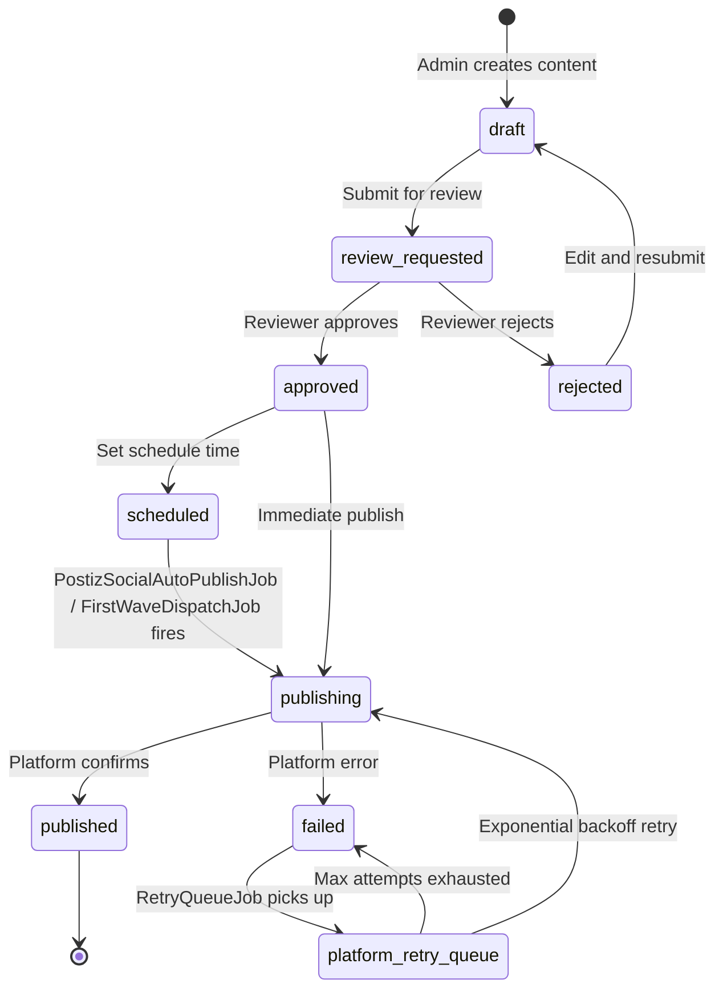

# C4 Level 3 — Components: Social Publishing Module

**Verified:** 2026-09-15 — grounded in `src/domain/social/db-schema.sql`,
`src/domain/social/first-wave-adapters.ts` (file confirmed), `src/cron/jobs/PostizSocialAutoPublishJob.ts`,
`src/cron/jobs/FirstWaveDispatchJob.ts`, `src/lib/postgres.ts`, route inspection.

The ref_social_platform table seed (from `db-schema.sql`) shows 17 rows with connectors:
- `postiz` — 12 platforms: Facebook, Instagram, LinkedIn, X/Twitter, Threads, TikTok, YouTube, Reddit,
  Pinterest, Bluesky, Mastodon, Discord, Slack
- `custom_connector` — 3 platforms: Telegram, WhatsApp Business, Google Business Profile
- `manual_only` — 1 platform: Quora (AI-drafted, human-posts)

The `@sohamyoga/shared-social-platforms` package defines 36 platforms (including extended set not
yet seeded to the social schema).

## Component Diagram

```mermaid
graph TB
    Admin([Admin user]):::actor

    subgraph "Next.js Frontend — Social Publishing Components"
        CC[Unified Command Center\n/admin/command-center\nLive/publish/schedule/approve\n34+ platforms shown]:::component
        PIM[Platform Integration Manager\n/admin/platform-integration\nEnable/disable platforms\nSystem users · OAuth flow\nConnector status per platform]:::component
        SIH[Social Intelligence Hub\n/admin/social-intelligence\nAnalytics · hashtag trends\nContent calendar\n6-platform analytics sync]:::component
        PSC[Platform Scenarios\n/admin/platform-scenarios\n645 scenarios loaded\nFeature gating per platform]:::component
        PCW[Platform Credentials Wizard\n/admin/platform-credentials\n36 platforms · 203+ credential steps\nOpenBao-backed secret storage]:::component
        CLIB[Content Library\n/admin/content-library\nDraft management\nMulti-platform variant sets]:::component
    end

    subgraph "API Routes"
        PUBAPI[POST /api/social/publish\nPublish / schedule endpoint]:::api
        PERMAPI[POST /api/social/check-permissions\nPlatform feature permission check]:::api
        SYNCAPI[GET /api/admin/command-center/sync-all\nSync live metrics into unified_content_item]:::api
    end

    subgraph "Platform Adapters"
        PostizAdapter[Postiz Adapter\n12 platforms via Postiz REST\nGated on POSTIZ_PUBLIC_API_KEY\nCurrently unset in this environment]:::adapter
        FWAdapter[First-Wave Adapters\nTelegram Bot API\nDiscord Webhook\nMastodon v1/statuses\nBluesky app-password\nDirect — no Postiz dependency]:::adapter
        CustomAdapter[Custom Connectors\nWhatsApp Business Cloud API\nGoogle Business Profile\nGitHub Releases\nPinterest v5 · Vimeo · Patreon\nTrustpilot · etc.]:::adapter
        ManualAdapter[Manual Adapter\nQuora and manual_only platforms\nAI drafts content\nHuman posts manually\nReturns status=manual_required]:::adapter
    end

    subgraph "Cron Jobs — Social"
        PAJob[PostizSocialAutoPublishJob\nSchedule: */5 * * * *\nPublishes Facebook + LinkedIn\nvia Postiz when credentials set]:::job
        FWJob[FirstWaveDispatchJob\nSchedule: */5 * * * *\nTelegram/Discord/Mastodon/Bluesky\nDirect API — no Postiz]:::job
        CCSync[CommandCenterSyncJob\nSchedule: 0 */2 * * *\nSyncs impressions/reach/clicks\nfrom social_post_analytics\ninto unified_content_item]:::job
        SASync[SocialAnalyticsSyncJob\nSchedule: 0 */6 * * *\nAggregates 6-platform analytics\ninto social_platform_analytics]:::job
        SCIdea[SocialContentIdeaJob\nSchedule: 5 * * * *\nEnqueues campaign briefs\nfor MarketingAutomationJob]:::job
        HTREND[HashtagTrendJob\nSchedule: 0 7 * * *\nOllama trending_score\nfor top 120 hashtags]:::job
        SAlert[SocialAlertScanJob\nSchedule: */30 * * * *\nChecks alert rules\nviral spikes / failed posts]:::job
    end

    subgraph "PostgreSQL Tables — Social"
        PG_UCI[unified_content_item\nMaster content record\nAll platforms / all states]:::table
        PG_RSP[ref_social_platform\n17 platform rows\nconnector type per platform]:::table
        PG_SA[social_account\nConnected platform accounts\ntenant_id · platform · status]:::table
        PG_SP[social_post\nPer-platform post record\nstatus: queued→published/failed]:::table
        PG_SPA[social_post_analytics\nPer-post metrics\nimpressions · reach · clicks]:::table
        PG_PFP[platform_feature_permission\nFeature gating per platform\nallows/blocks actions]:::table
        PG_SHP[social_hashtag_performance\nTop 120 hashtags\ntrending_score · post_count_this_week]:::table
        PG_SPC[platform_scenario\n645 scenarios\nFeature + scenario config]:::table
        PG_HHP[platform_health_check\nPer-platform health snapshots\nlast 1000 rows per platform]:::table
    end

    Admin --> CC
    Admin --> PIM
    Admin --> SIH
    Admin --> PSC
    Admin --> PCW
    Admin --> CLIB
    CC --> PUBAPI
    CC --> PERMAPI
    CC --> SYNCAPI
    PUBAPI --> PostizAdapter
    PUBAPI --> FWAdapter
    PUBAPI --> CustomAdapter
    PUBAPI --> ManualAdapter
    PERMAPI --> PG_PFP
    PUBAPI --> PG_UCI
    PUBAPI --> PG_SP
    PAJob --> PostizAdapter
    FWJob --> FWAdapter
    CCSync --> PG_SPA
    CCSync --> PG_UCI
    SASync --> PG_SPA
    HTREND --> PG_SHP
    SAlert --> PG_SPA
    SAlert --> PG_SP
    CC --> PG_UCI
    SIH --> PG_SPA
    PSC --> PG_SPC
    PIM --> PG_SA
    PIM --> PG_RSP

    classDef actor fill:#d4e6f1,stroke:#2c5282,color:#1a1a1a
    classDef component fill:#1e40af,color:#ffffff,stroke:#1e3a8a
    classDef api fill:#e8f5e9,stroke:#2e7d32,color:#1a1a1a
    classDef adapter fill:#fff3cd,stroke:#856404,color:#1a1a1a
    classDef job fill:#f3e5f5,stroke:#7c3aed,color:#1a1a1a
    classDef table fill:#d4edda,stroke:#155724,color:#1a1a1a
```

## Component Descriptions

### UI Components

| Component | Route | Key capability |
|---|---|---|
| Unified Command Center | `/admin/command-center` | Live/publish/schedule for 34+ platforms; approve/reject workflow; syncs metrics from `unified_content_item` |
| Platform Integration Manager | `/admin/platform-integration` | Enable/disable platforms, system-user setup, OAuth flow initiation, connector status display |
| Social Intelligence Hub | `/admin/social-intelligence` | 6-platform analytics (YouTube/Facebook/Instagram/Twitter/LinkedIn/TikTok), hashtag performance, content calendar |
| Platform Scenarios | `/admin/platform-scenarios` | 645 scenarios loaded from `platform_scenario` table; feature gating per platform |
| Platform Credentials Wizard | `/admin/platform-credentials` | Multi-step wizard for 36 platforms, 203+ credential steps; secrets stored via OpenBao |
| Content Library | `/admin/content-library` | Draft management, multi-platform variant sets, content review queue |

### Adapter Layer

The adapter layer follows a graceful-degradation pattern: when credentials are missing, adapters
return `{status:'manual_required'}` or log an honest skip — they never fake a successful publish.

| Adapter | Platforms | Credential requirement |
|---|---|---|
| Postiz Adapter | 12 platforms (Facebook, Instagram, LinkedIn, X, Threads, TikTok, YouTube, Reddit, Pinterest, Bluesky, Mastodon, Discord, Slack) | `POSTIZ_PUBLIC_API_KEY` + Postiz server running |
| First-Wave Adapters | Telegram, Discord, Mastodon, Bluesky | Per-platform: `TELEGRAM_BOT_TOKEN`, Discord webhook URL, Mastodon instance + token, Bluesky app-password |
| Custom Connectors | WhatsApp, Google Business, GitHub, Pinterest, Vimeo, Patreon, Trustpilot | Per-platform env vars; see `PlatformHealthCheckJob` `HEALTH_ENDPOINTS` for known API endpoints |
| Manual Adapter | Quora, manual-only platforms | None — AI drafts content, status returned as `manual_required` |

### Content State Machine

States from `ref_draft_status` (draft level) and `ref_post_status` (per-platform post level):
- Draft-level: `draft`, `review_requested`, `approved`, `rejected`, `scheduled`, `publishing`, `published`, `failed`, `paused`
- Post-level: `queued`, `publishing`, `published`, `failed`, `cancelled`, `paused`
