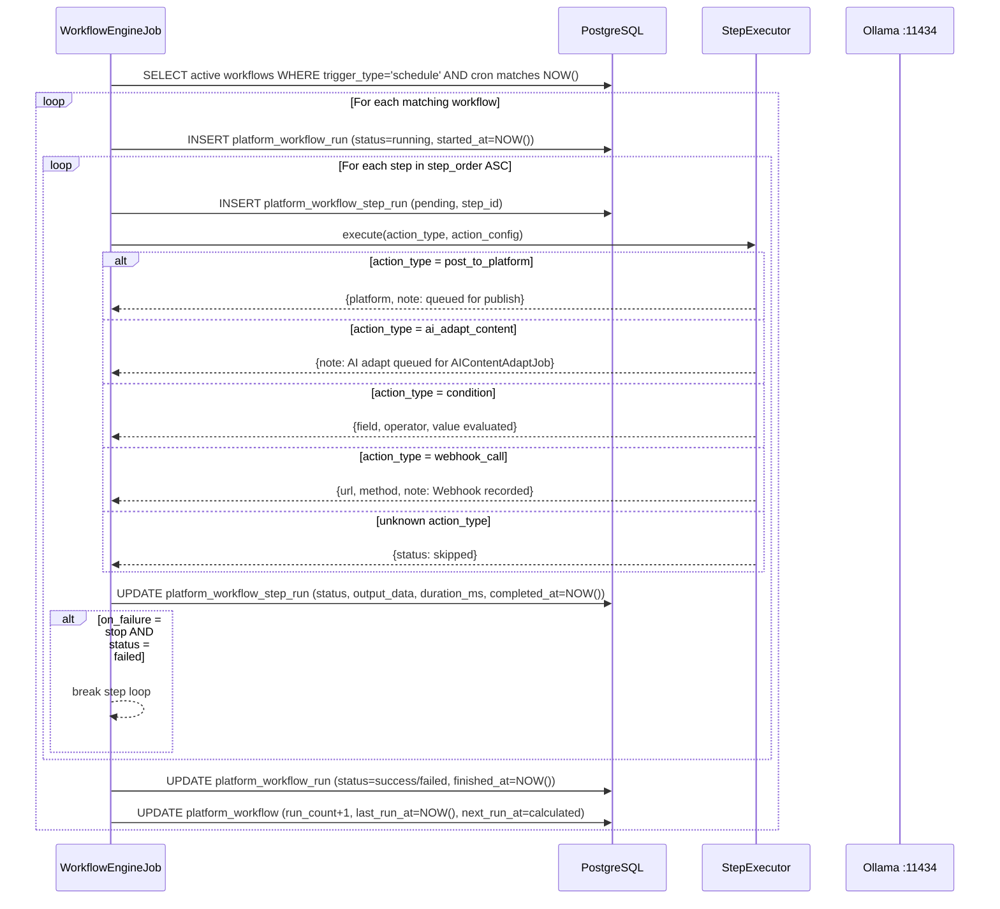
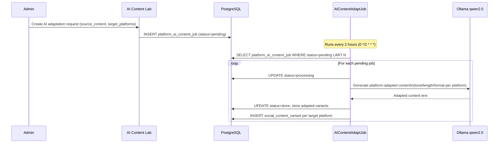

# C4 Level 3 — Components: Workflow & AI Automation

**Verified:** 2026-09-15 — grounded in `src/cron/jobs/WorkflowEngineJob.ts` (read directly),
`src/cron/jobs/AIContentAdaptJob.ts` (confirmed file), `src/cron/CronRegistry.ts`,
`ai-orchestrator-platform/backend/app/agents/registry.py`,
`ai-orchestrator-platform/backend/pyproject.toml` (LangChain/LangGraph deps confirmed).

## Component Diagram

```mermaid
graph TB
    Admin([Admin user]):::actor

    subgraph "Next.js Frontend — Workflow Components"
        PWF[Platform Workflows\n/admin/platform-workflows\n6-tab visual workflow builder\nSchedule/On-demand/Webhook triggers\nStep sequencing + condition branching]:::component
        AILab[AI Content Lab\n/admin/platform-workflows/ai-adapt\nOllama-powered content adaptation\nPer-platform tone/length/format\nQueues platform_ai_content_job rows]:::component
        AgentUI[Agent Supervisor UI\n/admin/agent-supervisor\nAgent run history\nTest case results\nLangSmith trace links]:::component
    end

    subgraph "Workflow Cron Jobs"
        WEJob[WorkflowEngineJob\nSchedule: */5 * * * *\nFinds active schedule-triggered workflows\nwhose cron next_run matches NOW()\nExecutes steps sequentially\nWrites platform_workflow_run\n+ platform_workflow_step_run]:::job
        AIAdapt[AIContentAdaptJob\nSchedule: 0 */2 * * *\nProcesses pending platform_ai_content_job rows\nCalls Ollama qwen2.5 per platform\nStores adapted variants\ntimeoutMs: 300_000]:::job
        MktAuto[MarketingAutomationJob\nSchedule: */2 * * * *\nClaims tenant campaign briefs\nGenerates copy/banner-prompt/video scripts\nvia local Ollama\ntimeoutMs: 240_000]:::job
        CamAdapt[CampaignAdaptationJob\nSchedule: 15 * * * *\nAI-adapts pending campaign content\nper platform using Ollama]:::job
    end

    subgraph "AI Orchestrator — Agent Layer (port 8100)"
        Supervisor[Supervisor Agent\nLangGraph router\nRoutes tasks to specialized agents\nllama3.2 model]:::agent
        ContentAgent[Content Agent\ntools: generate_social_post\nadapt_content_for_platform\nOllama llama3.2]:::agent
        AnalyticsAgent[Analytics Agent\ntools: analyze_platform_performance\nget_best_posting_time\nReads PostgreSQL]:::agent
        ReviewAgent[Review Agent\ntools: classify_review_sentiment\nOllama llama3.2]:::agent
        SchedulingAgent[Scheduling Agent\ntools: get_best_posting_time\nReads PostgreSQL]:::agent
        LSTracer[LangSmith Tracer\nlangsmith SDK v>=0.1\nCaptures all agent runs\nTrace ID stored in SQLite\nExternal dashboard link]:::infra
    end

    subgraph "PostgreSQL Tables — Workflow"
        PW[platform_workflow\nWorkflow definitions\ntrigger_type · trigger_config\nlast_run_at · run_count]:::table
        PWS[platform_workflow_step\nStep definitions\nstep_order · action_type\naction_config · on_failure\ncondition_field/operator/value]:::table
        PWR[platform_workflow_run\nExecution history\nstatus: running/success/failed\nstarted_at · finished_at]:::table
        PWSR[platform_workflow_step_run\nPer-step execution result\nstatus · output_data\nerror_message · duration_ms]:::table
        PAICJ[platform_ai_content_job\nAI adaptation job queue\nsource_content · target_platforms\nstatus: pending/processing/done/failed]:::table
    end

    subgraph "SQLite DB — Agent Runs"
        AR[agent_run\nid · agent_name · task_input\ntask_output · status\nlangsmith_trace_id · duration_ms]:::table
        ATC[agent_test_case\nPre-seeded test cases\nagent_name · input · expected_output]:::table
        ATR[agent_test_result\nTest run results\npass/fail · actual_output]:::table
    end

    Admin --> PWF
    Admin --> AILab
    Admin --> AgentUI
    PWF --> PW
    PWF --> PWS
    AILab --> PAICJ
    AgentUI --> AR
    AgentUI --> ATC
    AgentUI --> ATR
    WEJob --> PW
    WEJob --> PWS
    WEJob --> PWR
    WEJob --> PWSR
    AIAdapt --> PAICJ
    Supervisor --> ContentAgent
    Supervisor --> AnalyticsAgent
    Supervisor --> ReviewAgent
    Supervisor --> SchedulingAgent
    ContentAgent --> LSTracer
    AnalyticsAgent --> LSTracer
    ReviewAgent --> LSTracer
    SchedulingAgent --> LSTracer
    LSTracer --> AR
    AgentUI --> LSTracer

    classDef actor fill:#d4e6f1,stroke:#2c5282,color:#1a1a1a
    classDef component fill:#1e40af,color:#ffffff,stroke:#1e3a8a
    classDef job fill:#f3e5f5,stroke:#7c3aed,color:#1a1a1a
    classDef agent fill:#fff3cd,stroke:#856404,color:#1a1a1a
    classDef infra fill:#e8eaf6,stroke:#3949ab,color:#1a1a1a
    classDef table fill:#d4edda,stroke:#155724,color:#1a1a1a
```

## Workflow Step Action Types

From `WorkflowEngineJob.ts` switch statement (real, verified):

| Action type | What it does |
|---|---|
| `wait` | Simulated delay — `action_config.delay_seconds` |
| `post_to_platform` | Queues content for platform publish via adapter |
| `ai_adapt_content` | Creates `platform_ai_content_job` row for `AIContentAdaptJob` to process |
| `send_whatsapp` | Queues WhatsApp message via `WhatsAppMessageQueueJob` |
| `send_email` | Queues email (Note: email dispatch not yet configured in environment) |
| `condition` | Evaluates `condition_field` / `condition_operator` / `condition_value` for branching |
| `webhook_call` | Records outbound webhook call |
| `tag_customer` | Queues customer tag action |

## LangGraph Agent Registry (real — from `agents/registry.py`)

```python
AGENT_REGISTRY = {
    "supervisor":         { "desc": "Routes tasks via LangGraph supervisor pattern", "model": "llama3.2", "tools": ["all"] },
    "content_agent":      { "desc": "Generates/adapts social content",               "model": "llama3.2", "tools": ["generate_social_post", "adapt_content_for_platform"] },
    "analytics_agent":    { "desc": "Analyzes platform performance",                 "model": "llama3.2", "tools": ["analyze_platform_performance", "get_best_posting_time"] },
    "review_agent":       { "desc": "Classifies review sentiment",                   "model": "llama3.2", "tools": ["classify_review_sentiment"] },
    "scheduling_agent":   { "desc": "Picks optimal posting windows",                 "model": "llama3.2", "tools": ["get_best_posting_time"] },
}
```

## Workflow Execution Sequence



## AI Content Adaptation Flow


