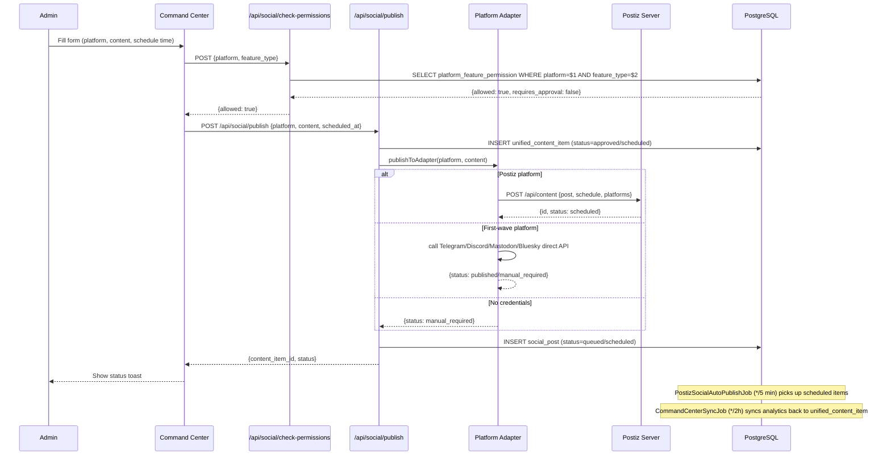

# High-Level Design — sohamyoga Digital Marketing Platform

**Verified:** 2026-09-15 — synthesized from `sohamyoga-frontend/HLD.md` (verified 2026-09-07),
`sohamyoga-frontend/LLD.md`, `MASTER_HLD.md`, `MASTER_INTEGRATION_MAP.md`,
`src/cron/CronRegistry.ts`, `ai-orchestrator-platform/backend/pyproject.toml`,
direct DB counts (496 tables, 188 module registry entries).

**Cross-reference:** This document adds an index view of the sohamyoga-frontend portal for
architecture consumers. The definitive per-portal detail lives in
[sohamyoga-frontend/HLD.md](sohamyoga-frontend/HLD.md) and [sohamyoga-frontend/LLD.md](sohamyoga-frontend/LLD.md).

---

## 1. Executive Summary

sohamyoga is an enterprise digital-marketing suite with yoga-studio operations as one vertical.
The primary product is a generic, multi-tenant marketing platform covering:

- **Social publishing** — 36 social/content platforms via three connector types (Postiz SaaS,
  direct first-wave adapters, custom connectors); 12 in Postiz, 3 direct, 1 manual in the
  live social schema seed
- **AI automation** — 93 cron jobs, 29 using local Ollama; zero cloud AI tokens after setup;
  LangChain + LangGraph multi-agent supervisor in the AI Orchestrator sidecar
- **Affiliate management** — code-based referral tracking, tiered commission, fraud detection,
  monthly payout batches
- **Real-time observability** — per-platform health checks every 5 minutes across 36 platforms,
  rate-limit snapshots, retry queues, API log with 30-day retention
- **Module registry** — self-cataloging system tracking 188 modules: 164 real / 23 partial / 1
  not_built (live DB count, 2026-09-07)

---

## 2. Architecture Principles

| Principle | Implementation |
|---|---|
| **Local-first AI** | Ollama before any cloud LLM; `qwen2.5:latest` default in sohamyoga-frontend; `llama3.2` in AI Orchestrator agents; all 29 Ollama-using cron jobs produce zero cloud tokens |
| **Credential security** | Secrets in `.env` only, fetched at runtime via OpenBao; `check-env` endpoints return boolean only — never expose key values |
| **Graceful degradation** | Adapters return `{status:'manual_required'}` or log an honest skip when credentials are missing; never fabricate a successful publish |
| **No ORM** | Raw `pg` pool (`src/lib/postgres.ts`) — deliberate choice, ADR-0001; 144+ domain-sharded `.sql` files |
| **Polyglot persistence** | PostgreSQL 16 (sohamyoga-frontend, 496 tables); SQLite (AI Orchestrator agent runs); better-sqlite3 (TalentsHill) |
| **Per-route auth** | No central `middleware.ts`; `getAdminPrincipal()` / `getCustomerPrincipal()` called per route handler; 230 admin-gated routes, 38 customer-gated |
| **No async messaging** | Every cross-component call is synchronous HTTP or DB poll; no Redis, no message broker, no Celery |
| **Modular monolith** | One Next.js process, one Postgres instance, 57 domain modules — not microservices |

---

## 3. High-Level Architecture Diagram

```mermaid
graph TB
    subgraph "User Layer"
        ADMIN[Admin Portal\n/admin/* — 142 pages]
        CUSTOMER[Customer Portal\n/customer/* — 32 pages]
        PUBLIC[Public pages\n~47 pages]
    end

    subgraph "Application Layer"
        NEXT[Next.js 14 App Router\nport 3010 container\n221 pages · 383 API routes\n57 domain modules · no ORM]
        NET[SohamYoga.Web\n.NET auth backend\n/api/auth/me cookie-forward\nSeparate SQLite DB]
        CRON[93 Cron Jobs\nnode-cron + tsx\nsrc/cron/runner.ts\n29 use Ollama]
        FASTAPI[AI Orchestrator\nFastAPI :8100\nLangChain + LangGraph\n5 specialized agents]
    end

    subgraph "AI Layer"
        OLLAMA[Ollama :11434\nqwen2.5 default\nllama3.2 for orchestrator\nLocal — zero cloud tokens]
        LANGSMITH[LangSmith SDK\nAgent run tracing\nTrace ID in SQLite\nExternal dashboard]
        LANGFLOW[LangFlow :7860\nVisual flow builder]
    end

    subgraph "Data Layer"
        PG[(PostgreSQL 16 :5437\n496 tables\n57-domain sharded SQL\nno ORM no central migrations)]
        SQLITE[(SQLite\nAI Orchestrator\nagent_run / test tables)]
    end

    subgraph "Integration Layer"
        POSTIZ[Postiz server\nSocial scheduler\n12 platforms\nGated on API key]
        FWAVE[First-Wave Adapters\nTelegram · Discord\nMastodon · Bluesky\nDirect REST]
        CUSTOM[Custom Connectors\nWhatsApp · Google Business\nGitHub · Pinterest · Vimeo\nPatreon · Trustpilot]
        N8N[n8n local\nParallel automation\nInstagram/Facebook\nReviews/YouTube]
    end

    subgraph "Shared Package"
        PKG[@sohamyoga/shared-social-platforms\n36 platforms · tab configs\nscenarios · API catalog]
    end

    ADMIN --> NEXT
    CUSTOMER --> NEXT
    PUBLIC --> NEXT
    NEXT -->|cookie-forward auth| NET
    NEXT -->|raw pg| PG
    NEXT -->|local LLM via bridge| OLLAMA
    NEXT -->|REST| POSTIZ
    NEXT -->|direct REST| FWAVE
    NEXT -->|direct REST| CUSTOM
    NEXT -->|internal HTTP| FASTAPI
    CRON -->|pg pool| PG
    CRON -->|Ollama calls| OLLAMA
    FASTAPI --> SQLITE
    FASTAPI -->|LangChain-Ollama| OLLAMA
    FASTAPI --> LANGSMITH
    LANGFLOW --> FASTAPI
    N8N -.->|parallel, separate| NEXT
    PKG -.->|shared dep| NEXT
```

---

## 4. Module Inventory

Modules are tracked in the live `module_registry` table. Counts as of 2026-09-07:
- **real:** 164 modules
- **partial:** 23 modules
- **not_built:** 1 module
- **total:** 188 cataloged

Key modules by domain group (interpretive grouping — 57 domain folders is the ground truth):

| Domain group | Key admin routes | Key DB tables | Key cron jobs |
|---|---|---|---|
| Social Publishing | `/admin/command-center`, `/admin/platform-integration`, `/admin/platform-scenarios`, `/admin/platform-credentials` | `unified_content_item`, `social_account`, `social_post`, `social_post_analytics`, `ref_social_platform`, `platform_feature_permission` | `postiz-social-auto-publish`, `first-wave-dispatch`, `command-center-sync`, `social-analytics-sync`, `social-content-idea` |
| Social Intelligence | `/admin/social-intelligence` | `social_hashtag_performance`, `social_alert_rule`, `social_alert_event`, `social_calendar_entry` | `hashtag-trend`, `social-alert-scan`, `content-calendar-reminder` |
| Workflow & Automation | `/admin/platform-workflows` | `platform_workflow`, `platform_workflow_step`, `platform_workflow_run`, `platform_workflow_step_run`, `platform_ai_content_job` | `workflow-engine`, `ai-content-adapt`, `marketing-automation`, `campaign-adaptation` |
| Platform Monitoring | `/admin/platform-monitoring` | `platform_health_check`, `platform_api_log`, `platform_rate_limit_snapshot`, `platform_webhook_event`, `platform_retry_queue` | `platform-health-check`, `rate-limit-snapshot`, `retry-queue`, `api-log-cleanup`, `api-quota-monitor` |
| Affiliate | `/admin/affiliate-*`, `/customer/affiliate/*`, `/r/[code]` | `affiliate_partner`, `affiliate_tier_rule`, `affiliate_fraud_flag`, `referral_code`, `referral_click`, `commission`, `affiliate_payout` | `affiliate-partner-tier`, `affiliate-payout`, `affiliate-fraud-scan`, `affiliate-commission-settle` |
| CRM & Campaigns | `/admin/crm`, `/admin/lifecycle-campaigns` | `crm_contact`, `lifecycle_campaign`, `campaign_lead`, `drip_sequence`, `journey_touchpoint` | `campaign-trigger`, `campaign-health-audit`, `lead-nurturing`, `drip-sequence-processor` |
| Marketing AI | `/admin/marketing` | `campaign_brief`, `marketing_search_visibility_snapshot` | `marketing-automation`, `campaign-copy-draft`, `video-script-draft`, `seo-report`, `search-visibility` |
| Yoga Studio Vertical | `/admin/classes`, `/admin/booking`, `/customer/classes` | `class_session`, `booking`, `student`, `teacher`, `practice_journal`, `wellness_score` | `wellness-score-compute`, `wellness-scoring`, `ai-coach`, `streak-update`, `milestone-check`, `badge-award` |
| Analytics & Reporting | `/admin/analytics` | `social_platform_analytics`, `tracking_event`, `analytics_aggregation` | `analytics-aggregation`, `funnel-stage-analysis`, `viral-detection` |
| Surveys & Feedback | `/admin/surveys` | `survey`, `survey_answer`, `nps_score`, `csat_score`, `ces_score` | `nps-invitation`, `nps-calculation`, `csat-calculation`, `ces-calculation`, `review-request` |
| Gamification | `/admin/community`, `/customer/community` | `points_ledger`, `badge`, `leaderboard` | `leaderboard-refresh`, `milestone-check`, `badge-award` |
| AI Governance | `/admin/ai-governance` | `use_case_registry`, `module_registry` | `backlog-prioritization`, `module-boundary-quality`, `feature-gap-advisor`, `module-registry-drift-sweep` |
| Platform Setup | `/admin/platform-credentials`, `/admin/platform-scenarios` | `platform_integration_config`, `platform_scenario`, `platform_credential_value` | `postiz-provider-health`, `brand-profile-draft`, `platform-bio-draft` |
| Security | `/admin/security` | `security_scan_run`, `security_finding` | `security-scan` (SAST/SCA/IaC/DAST) |
| Ingestion | `/admin/integrations` | `chatgpt_shared_snapshot`, connector tables | `google-drive-scan`, `slack-scan`, `ingestion-source-refresh` |

---

## 5. Social Post Data Flow

How a social post flows through the system end-to-end:



---

## 6. Security Architecture

| Layer | Implementation | Finding |
|---|---|---|
| Auth gateway | Per-route `getAdminPrincipal()` / `getCustomerPrincipal()` calling .NET backend | No central `middleware.ts` — route skipping is possible if a new route is added without the guard call |
| Role model | Admin roles: `['Admin','Editor','Sales']`; customer: any authenticated principal; fine-grained `RolePermission` table layered on top | Working |
| Secrets | `.env` + OpenBao vault at runtime; `check-env` returns boolean only | OpenBao runs in ephemeral dev mode — secrets lost on restart (risk SEC-01) |
| Webhook verification | Platform-specific signature verification in webhook event handlers | Coverage varies per platform |
| SAST / SCA / IaC / DAST | `SecurityScanJob` shells out to semgrep, npm audit, trivy, OWASP ZAP; runs nightly at 01:30 UTC | Real CLI tools; findings persisted in `security_scan_run` / `security_finding` |
| Rate limiting | Per-platform, platform-specific; `RateLimitSnapshotJob` monitors at 85% quota threshold | No global API rate limiting found at the application layer |
| CSRF | Not found — identified as a consistent gap across all 5 custom auth systems in the repo audit | Risk noted in ATAM |

---

## 7. Scalability Considerations

**Current scale:** single-operator, single-machine deployment. No multi-node infrastructure found.

| Dimension | Current state | Horizontal scale path |
|---|---|---|
| Social publishing | Single Postiz container + single Next.js process | Separate Postiz to dedicated VM; add Postiz worker replicas |
| AI inference | Single Ollama daemon; circuit breaker in OllamaClient | Swap to larger Ollama model; add llama.cpp workers via AI Orchestrator LLAMACPP_MODELS dict |
| Cron jobs | All 93 jobs run in a single `cron` container | Extract heavy jobs (SecurityScanJob, BacklogPrioritizationJob) to separate workers |
| Database | Single Postgres 16, no read replicas | Add read replica; introduce connection pooler (PgBouncer) — pool max=10 is tight for 93 cron jobs + 383 API routes |
| n8n | Parallel local process | Move to dedicated n8n cloud or separate VM |
| LangChain caching | LangSmith traces per run; no response cache found | Add LangChain `SQLiteCache` or Redis cache for repeated prompts |

**Known bottleneck:** Pool max=10 in `src/lib/postgres.ts` for a system with 93 cron jobs running
concurrently plus 383 live API routes. The cron engine runs in a separate container with its own
pool, mitigating contention somewhat, but this should be revisited as job count grows.
