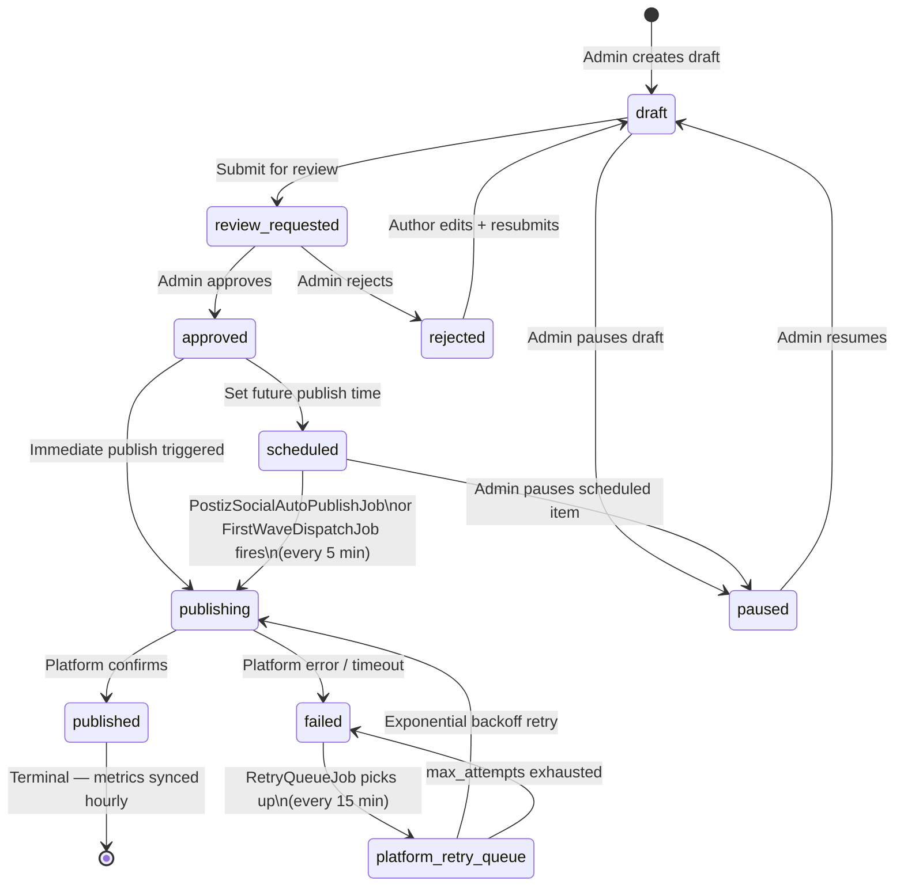
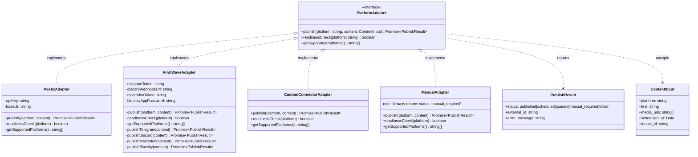
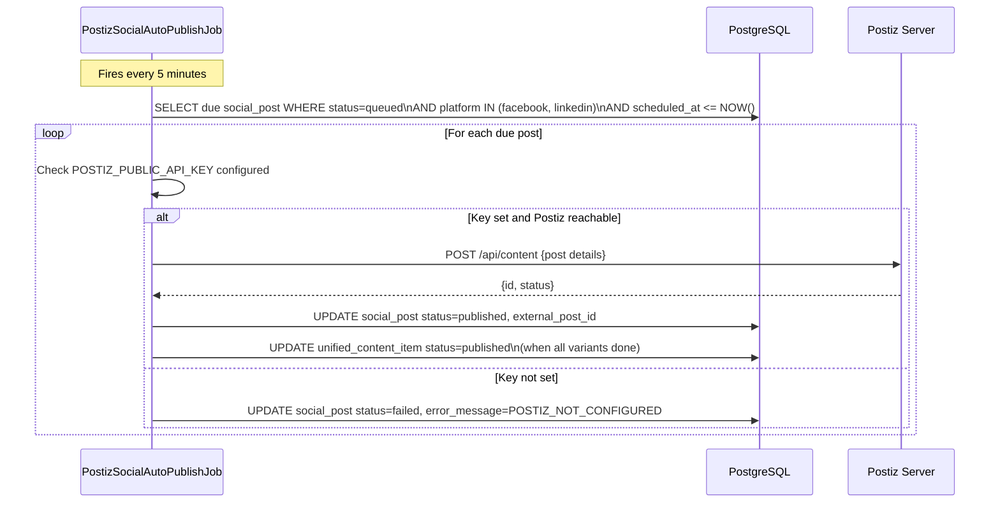

# LLD — Social Publishing Module

**Verified:** 2026-09-15 — grounded in `src/domain/social/db-schema.sql` (read directly),
`src/cron/jobs/PostizSocialAutoPublishJob.ts`, `src/cron/jobs/FirstWaveDispatchJob.ts`,
route inspection, `src/domain/social/first-wave-adapters.ts` (confirmed file exists).

---

## 1. Database Schema

Tables verified from `src/domain/social/db-schema.sql` and related schema files. Column types are
exact from the SQL source. Additional monitoring tables are in
[lld-workflow-engine.md](lld-workflow-engine.md) and [c4-level3-components-monitoring.md](c4-level3-components-monitoring.md).

### `ref_social_platform` — Platform reference table

```sql
CREATE TABLE IF NOT EXISTS ref_social_platform (
  platform              TEXT PRIMARY KEY,
  display_name          TEXT NOT NULL,
  connector             TEXT NOT NULL CHECK (connector IN ('postiz','custom_connector','manual_only')),
  max_characters        INTEGER,
  supports_scheduling   BOOLEAN NOT NULL DEFAULT TRUE,
  notes                 TEXT
);
```

Seeded with 17 platforms. Connector breakdown from seed:
- `postiz` (12): facebook, instagram, linkedin, x_twitter, threads, tiktok, youtube, reddit,
  pinterest, bluesky, mastodon, discord, slack
- `custom_connector` (3): telegram, whatsapp_business, google_business
- `manual_only` (1): quora_manual

The `@sohamyoga/shared-social-platforms` package defines 36 platforms; the remaining 19 are in
the shared package but not yet seeded to this table.

### `social_account` — Connected platform accounts

```sql
CREATE TABLE IF NOT EXISTS social_account (
  id                   UUID DEFAULT gen_random_uuid() PRIMARY KEY,
  tenant_id            UUID NOT NULL,
  workspace_id         UUID NOT NULL,
  platform             TEXT NOT NULL REFERENCES ref_social_platform(platform),
  account_name         TEXT NOT NULL,
  platform_account_id  TEXT NOT NULL,
  profile_url          TEXT,
  avatar_url           TEXT,
  status               TEXT NOT NULL REFERENCES ref_social_account_status(status),
  -- additional credential/token fields per platform
  created_at           TIMESTAMPTZ DEFAULT NOW(),
  updated_at           TIMESTAMPTZ DEFAULT NOW()
);
```

### `social_post` — Per-platform post record

```sql
CREATE TABLE IF NOT EXISTS social_post (
  id                   UUID DEFAULT gen_random_uuid() PRIMARY KEY,
  tenant_id            UUID NOT NULL,
  social_account_id    UUID REFERENCES social_account(id),
  platform             TEXT NOT NULL REFERENCES ref_social_platform(platform),
  content_text         TEXT,
  media_urls           TEXT[],
  scheduled_at         TIMESTAMPTZ,
  published_at         TIMESTAMPTZ,
  external_post_id     TEXT,
  status               TEXT NOT NULL REFERENCES ref_post_status(status),
  postiz_post_id       TEXT,
  error_message        TEXT,
  created_at           TIMESTAMPTZ DEFAULT NOW(),
  updated_at           TIMESTAMPTZ DEFAULT NOW()
);
```

### `social_post_analytics` — Per-post engagement metrics

Aggregated from platform API responses; synced by `SocialAnalyticsSyncJob` (every 6h) and
`CommandCenterSyncJob` (every 2h).

### `platform_feature_permission` — Feature gating per platform

Controls which features (scheduling, media upload, stories, etc.) are permitted per platform.
Used by the permission check API called from Command Center before any publish action.

### `platform_scenario` — Scenario/feature-gate definitions

645 scenarios loaded. Controls which platform features are enabled/locked/visible in the UI.

### `unified_content_item` — Master content record

Referenced in `src/app/api/admin/command-center/` routes; the canonical record tying together
content across all platforms and states. Contains aggregated impression/reach/click/engagement
metrics synced from `social_post_analytics` by `CommandCenterSyncJob`.

---

## 2. Publish Sequence Diagram

```mermaid
sequenceDiagram
    participant Admin as Admin
    participant CC as Command Center UI
    participant PermAPI as POST /api/social/check-permissions
    participant PubAPI as POST /api/social/publish
    participant Adapter as Platform Adapter
    participant Postiz as Postiz Server
    participant FWAdapter as First-Wave Adapter
    participant PG as PostgreSQL

    Admin->>CC: Select platform, write content, set schedule
    CC->>PermAPI: POST {platform, feature_type}
    PermAPI->>PG: SELECT platform_feature_permission\nWHERE platform=$1 AND feature_type=$2
    PG-->>PermAPI: {allowed, requires_approval}
    PermAPI-->>CC: {allowed: true, requires_approval: false}
    CC->>PubAPI: POST /api/social/publish\n{platform, content, scheduled_at, media_urls}
    PubAPI->>PG: INSERT unified_content_item (status=approved OR scheduled)

    alt Postiz connector platform
        PubAPI->>Adapter: PostizAdapter.publish(platform, content)
        Adapter->>Postiz: POST /api/content {posts, schedule_date, provider_account_id}
        Postiz-->>Adapter: {id, status: scheduled/published}
        Adapter-->>PubAPI: {external_id, status}
    else First-wave platform (Telegram/Discord/Mastodon/Bluesky)
        PubAPI->>FWAdapter: FirstWaveAdapter.publish(platform, content)
        FWAdapter->>FWAdapter: Credentials readiness check
        alt Credentials present
            FWAdapter-->>PubAPI: {status: published/queued}
        else Missing credentials
            FWAdapter-->>PubAPI: {status: manual_required}
        end
    else Custom connector
        PubAPI->>Adapter: CustomAdapter.publish(platform, content)
        Adapter-->>PubAPI: {status} or {status: manual_required}
    end

    PubAPI->>PG: INSERT social_post (status=queued/scheduled/published)
    PubAPI-->>CC: {content_item_id, social_post_id, status}
    CC-->>Admin: Status toast (success/scheduled/manual_required)
```



---

## 3. Content State Machine



Draft-level statuses (from `ref_draft_status`): `draft`, `review_requested`, `approved`,
`rejected`, `scheduled`, `publishing`, `published`, `failed`, `paused`

Post-level statuses (from `ref_post_status`): `queued`, `publishing`, `published`, `failed`,
`cancelled`, `paused`

---

## 4. Platform Adapter Class Diagram



---

## 5. PostizSocialAutoPublishJob Sequence (verified from file)

The `PostizSocialAutoPublishJob` (schedule `*/5 * * * *`) processes approved/scheduled
Facebook and LinkedIn variants through connected Postiz integrations. It completes the
master draft only after all variants finish.


