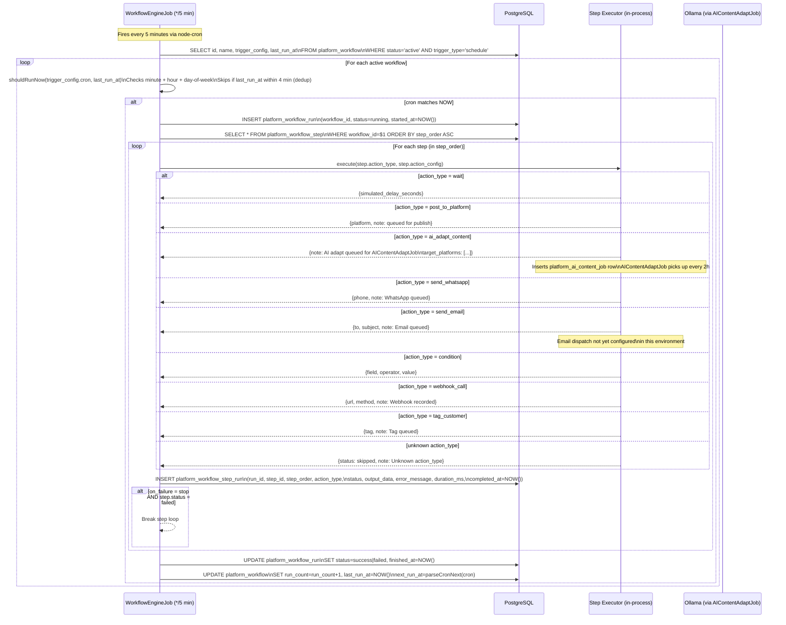
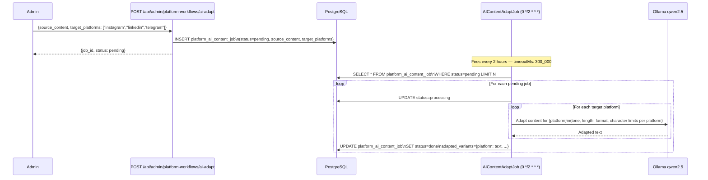

# LLD — Workflow Engine

**Verified:** 2026-09-15 — grounded in `src/cron/jobs/WorkflowEngineJob.ts` (read directly:
full step executor switch statement, all INSERT/UPDATE queries, table names, column names),
`src/app/api/admin/platform-workflows/` routes (confirmed 9 route files), `src/cron/CronRegistry.ts`.

---

## 1. Database Schema

Tables used by the Workflow Engine (inferred from `WorkflowEngineJob.ts` queries — no central
`.sql` file found for these tables; DDL is in migration files or applied programmatically).

### `platform_workflow` — Workflow definitions

```sql
-- Inferred from WorkflowEngineJob.ts queries and platform-workflows API routes
CREATE TABLE IF NOT EXISTS platform_workflow (
  id              SERIAL PRIMARY KEY,
  name            TEXT NOT NULL,
  trigger_type    TEXT NOT NULL,          -- 'schedule' | 'manual' | 'webhook'
  trigger_config  JSONB NOT NULL,         -- {cron: "0 9 * * *", description: "..."}
  status          TEXT NOT NULL DEFAULT 'active',   -- 'active' | 'paused' | 'archived'
  run_count       INTEGER NOT NULL DEFAULT 0,
  last_run_at     TIMESTAMPTZ,
  next_run_at     TIMESTAMPTZ,
  created_at      TIMESTAMPTZ DEFAULT NOW(),
  updated_at      TIMESTAMPTZ DEFAULT NOW()
);
```

### `platform_workflow_step` — Step definitions

```sql
-- From WorkflowEngineJob.ts: SELECT * FROM platform_workflow_step
CREATE TABLE IF NOT EXISTS platform_workflow_step (
  id                  SERIAL PRIMARY KEY,
  workflow_id         INTEGER NOT NULL REFERENCES platform_workflow(id),
  step_order          INTEGER NOT NULL,
  action_type         TEXT NOT NULL,   -- see action types below
  action_config       JSONB NOT NULL DEFAULT '{}',
  condition_field     TEXT,            -- for action_type='condition'
  condition_operator  TEXT,            -- 'eq' | 'gt' | 'lt' | 'contains'
  condition_value     TEXT,
  on_failure          TEXT NOT NULL DEFAULT 'continue',  -- 'continue' | 'stop'
  created_at          TIMESTAMPTZ DEFAULT NOW()
);
```

### `platform_workflow_run` — Execution history

```sql
-- From WorkflowEngineJob.ts: INSERT INTO platform_workflow_run
CREATE TABLE IF NOT EXISTS platform_workflow_run (
  id           SERIAL PRIMARY KEY,
  workflow_id  INTEGER NOT NULL REFERENCES platform_workflow(id),
  status       TEXT NOT NULL DEFAULT 'running',   -- 'running' | 'success' | 'failed'
  started_at   TIMESTAMPTZ DEFAULT NOW(),
  finished_at  TIMESTAMPTZ,
  created_at   TIMESTAMPTZ DEFAULT NOW()
);
```

### `platform_workflow_step_run` — Per-step execution results

```sql
-- From WorkflowEngineJob.ts: INSERT INTO platform_workflow_step_run
CREATE TABLE IF NOT EXISTS platform_workflow_step_run (
  id            SERIAL PRIMARY KEY,
  run_id        INTEGER NOT NULL REFERENCES platform_workflow_run(id),
  step_id       INTEGER NOT NULL REFERENCES platform_workflow_step(id),
  step_order    INTEGER NOT NULL,
  action_type   TEXT NOT NULL,
  status        TEXT NOT NULL,      -- 'success' | 'failed' | 'skipped'
  output_data   JSONB,
  error_message TEXT,
  duration_ms   INTEGER,
  completed_at  TIMESTAMPTZ
);
```

### `platform_ai_content_job` — AI adaptation job queue

```sql
-- From CronRegistry.ts description + AIContentAdaptJob.ts
CREATE TABLE IF NOT EXISTS platform_ai_content_job (
  id               SERIAL PRIMARY KEY,
  tenant_id        UUID NOT NULL,
  source_content   TEXT NOT NULL,
  target_platforms TEXT[] NOT NULL,
  status           TEXT NOT NULL DEFAULT 'pending',  -- 'pending' | 'processing' | 'done' | 'failed'
  adapted_variants JSONB,           -- {platform: adapted_text} map
  error_message    TEXT,
  created_at       TIMESTAMPTZ DEFAULT NOW(),
  updated_at       TIMESTAMPTZ DEFAULT NOW()
);
```

---

## 2. Workflow Execution Sequence

From `WorkflowEngineJob.ts` — complete verified flow:



---

## 3. Cron Expression Parser (verified from `WorkflowEngineJob.ts`)

The job uses a minimal in-process cron parser (`shouldRunNow` function). Real cron libraries
are not used for workflow trigger evaluation — the parser only handles:
- Standard 5-part cron expressions (`* * * * *`)
- Matches on UTC minute, UTC hour, and day-of-week
- Does NOT handle: `*/N` step syntax in workflow triggers (only `*` or exact integer)
- Deduplication window: skips re-run if `last_run_at` within 4 minutes

This is a documented limitation — complex workflow schedules (e.g., `*/30 * * * *`) may not
trigger correctly through this parser. The system-level `node-cron` in `CronRegistry.ts` uses
the full `node-cron` library and handles all cron syntax.

---

## 4. AI Content Adaptation Sub-flow



---

## 5. Workflow API Routes

From `src/app/api/admin/platform-workflows/` (9 confirmed route files):

| Route | Method | Purpose |
|---|---|---|
| `/api/admin/platform-workflows` | GET | List all workflows |
| `/api/admin/platform-workflows` | POST | Create workflow |
| `/api/admin/platform-workflows/[id]` | GET/PUT/DELETE | Workflow CRUD |
| `/api/admin/platform-workflows/[id]/steps` | GET/POST | List/create steps |
| `/api/admin/platform-workflows/[id]/steps/[step_id]` | PUT/DELETE | Step CRUD |
| `/api/admin/platform-workflows/[id]/run` | POST | Manual trigger run |
| `/api/admin/platform-workflows/[id]/runs` | GET | Run history |
| `/api/admin/platform-workflows/ai-adapt` | POST | Queue AI adaptation job |
| `/api/admin/platform-workflows/runs` | GET | Global run history |
| `/api/admin/platform-workflows/seed` | POST | Seed example workflows |
