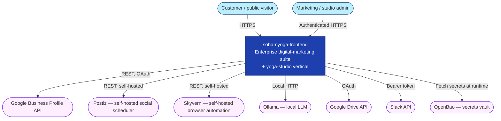
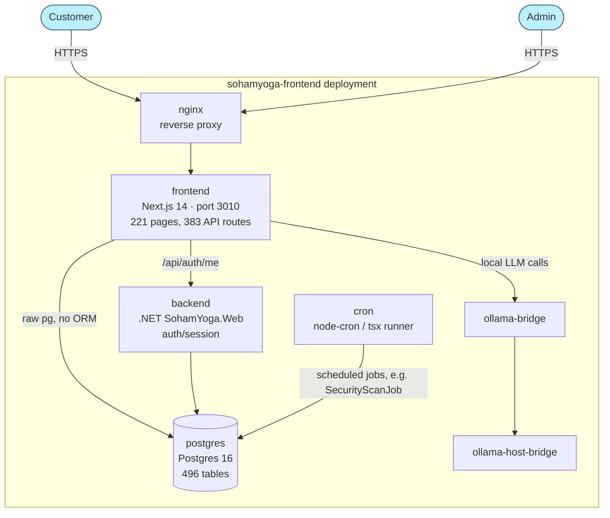
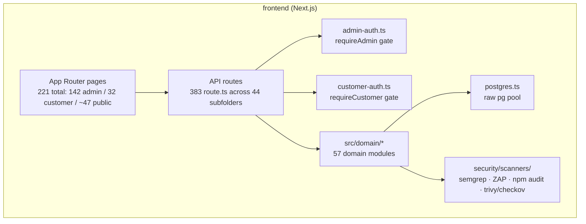

# C4 Model — sohamyoga-frontend

Filled from real `docker-compose.yml` topology and code reads — do not reuse the generic
`{{PLACEHOLDER}}` template at [../ARCHITECTURE.md](../ARCHITECTURE.md) for this portal; its
Redis/Celery/MLflow containers do not exist here.

## L1 — System Context

## L2 — Containers (real, from `docker-compose.yml`)

No Redis, no message broker, no Celery/MLflow — this system is simpler than a typical
FastAPI+Celery+Redis+MLflow stack; verify before assuming those components exist.

## L3 — Component view (frontend container, partial — 44 API subfolders is too many to diagram flat)

Representative slice, not exhaustive:

## Architectural decisions

See [ADR/](ADR/): 0001 (no ORM), 0002 (self-hosted web push), 0003 (explicit UI-coverage flags),
0004 (security scans in-app not CI).
