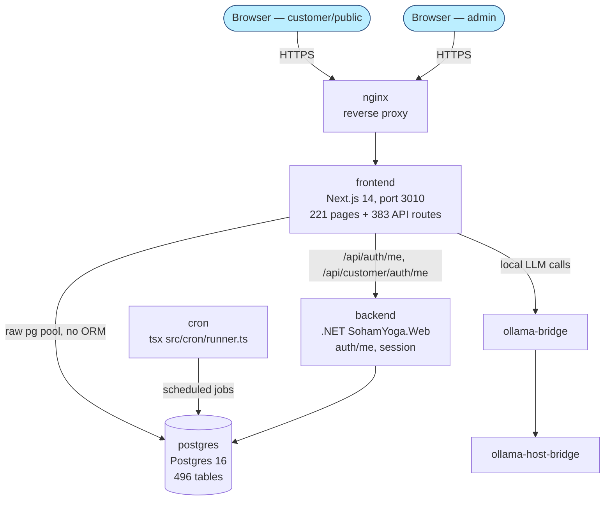

# High-Level Design — sohamyoga-frontend

**Status:** living document, grounded in direct code/DB investigation on 2026-09-07.
**Scope:** the `sohamyoga-frontend` portal only. Other portals in this repo (voice-agent-platform,
market-research-portal, ai-orchestrator-platform, SohamYoga .NET, ai-agents) are out of scope here —
see [../README.md](../../architecture/README_TEMPLATE.md) for the multi-portal index (to be built as a follow-up).

## 1. What this system is

Per [project memory](../../../CLAUDE.md) and the module domain list below: sohamyoga-frontend is a
**generic enterprise digital-marketing suite** — CRM, campaigns, social, ads, SEO, reputation,
e-commerce, surveys, referrals, gamification — with yoga-studio operations (booking, classes,
teachers, students) as one vertical running on top of the same platform, not the platform's primary
purpose.

## 2. Container topology (real, from `docker-compose.yml`)

7 services total: `postgres`, `backend`, `ollama-host-bridge`, `ollama-bridge`, `frontend`, `cron`, `nginx`.
No Redis, no message queue, no Celery/MLflow — this is a simpler topology than the repo's generic
`ARCHITECTURE.md` template assumes; do not copy that template's containers here without verifying.

## 3. Tech stack (verified via package.json / next.config.js / tsconfig.json / Dockerfile)

| Layer | Choice | Version | Note |
|---|---|---|---|
| Framework | Next.js (App Router) | ^14.2.35 | `output: 'standalone'` |
| UI | React | ^18.3.1 | `@types/react` devDep is ahead at ^19 — type-only, not a runtime mismatch |
| Language | TypeScript | ^5.9.3 | `strict: true` |
| DB access | `pg` (raw driver) | ^8.22.0 | **No ORM** — hand-rolled pool at `src/lib/postgres.ts` (see [ADR-0001](ADR/0001-no-orm.md)) |
| Styling | Tailwind CSS | ^3.4.19 | |
| Unit tests | Jest + ts-jest | ^29.7.0 | 125 test files under `src/__tests__/` |
| E2E tests | Playwright + axe-core | ^1.62.1 | 28 spec files under `tests/e2e/` |
| AI-browser testing | Stagehand | ^3.7.1 | `tests/browser/stagehand-smoke.ts` |
| Push notifications | `web-push` (self-hosted VAPID) | ^3.6.7 | No 3rd-party push service |
| Scheduling | `node-cron` | ^4.6.0 | Runs in the separate `cron` container/image |
| Local LLM | Ollama client | — | `src/lib/ollama.ts`, model `qwen2.5:latest` default |
| Runtime | Node.js | >=22.13.0 | `node:22-alpine` in Docker |
| Shared code | `@sohamyoga/shared-backend` | workspace | Local monorepo package, `transpilePackages` |

## 4. Module/domain map (57 top-level folders under `src/domain/`)

Grouped by function (grouping is interpretive; the flat list of 57 is the ground truth):

- **Yoga-studio vertical:** booking, yoga, pose, student, teacher, scheduling
- **Identity/access:** identity, security, customer
- **Marketing suite (the primary product):** marketing, campaign, social, ads, seo, growth, referral,
  coupon, pricing, ecommerce, banner, cta, funnel, landingpage, experimentation, survey, journey,
  gamification, community, reputation, competitor
- **Platform infrastructure:** mcp (Model-Context-Protocol tool/gateway registries), module-registry
  (the cataloging system described in §5), ingestion (Google Drive/Slack/ChatGPT-share connectors),
  platform-setup (credential/scenario management via OpenBao), observability, assurance,
  usecase-registry
- **Shared:** `shared/HealthModel.ts` — one computation reused by 6 domain-specific health scores
  (Social, Feedback, Research, Course, Communication, Brand)
- **Known gap:** `teaching/` exists as an empty directory — no files.

`src/app/` surface area: 221 `page.tsx` (142 admin, 32 customer, ~47 public), 383 `route.ts` under
44 API subfolders — API routes are the dominant surface by file count.

## 5. Module-registry subsystem (self-cataloging, not aspirational)

`module_registry` Postgres table tracks every module's real build status. Live count as of
2026-09-07 (queried directly, not from seed files — seed files are stale incremental batches):

| built_status | count |
|---|---|
| real | 164 |
| partial | 23 |
| not_built | 1 |
| **total** | **188** |

Full partial/not_built breakdown with real missing-items text: see [FEATURES.md](FEATURES.md).

## 6. Cross-cutting subsystems

- **Security scanning** — `src/domain/security/scanners/` shells out to real CLI tools (semgrep,
  OWASP ZAP, npm audit, trivy/checkov) from an in-app cron-triggered feature, not CI. See
  [SECURITY.md](SECURITY.md).
- **Cron jobs** — `src/cron/runner.ts` + `src/cron/jobs/*` (not fully enumerated in this pass —
  follow-up needed for a complete job inventory).

## 7. Related documents

- [LLD.md](LLD.md) — component-level design, DB design, auth gate implementation
- [C4.md](C4.md) — formal C4 context/container diagrams
- [FEATURES.md](FEATURES.md) — feature status matrix, pending list, recorded user stories
- [INTEGRATION.md](INTEGRATION.md) — real external integrations
- [SECURITY.md](SECURITY.md) — security layers, SAST/DAST/SCA/SBOM inventory
- [ATAM.md](ATAM.md) — architecture tradeoff analysis
- [ADR/](ADR/) — architecture decision records
