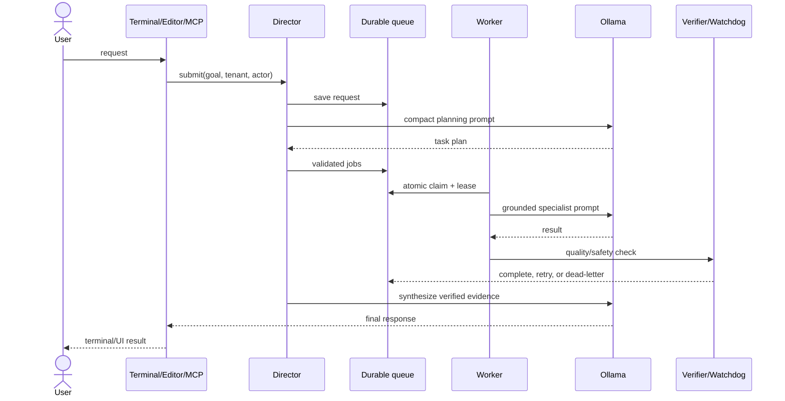

# Ollama module orchestration — process, data, sequence and LLD

## Process flow

```text
Terminal/editor/web/MCP request
  -> authenticate + tenant context
  -> deterministic validation/redaction/compaction
  -> persist request
  -> Ollama planner
  -> validate specialist names and dependencies
  -> priority queue
  -> serialized local worker
  -> role model (SLM/code/text/vision/embed)
  -> quality + safety verification
  -> retry/dead-letter/human review
  -> response synthesis
  -> terminal/API/dashboard response
```

## Data flow

```text
request input -> requests -> agent_tasks -> model_calls
                     |            |             |
                     |            +-> job_events+-> metrics/ledger
                     |                          |
                     +-> final report <- verifier+
                              |
                              +-> terminal / gateway / MCP / dashboard
```

Business modules exchange identifiers and events, not private table copies. `tenant_id`, `organization_id`, `user_id`, `product_id`, `service_id`, `tax_rule_id`, `price_id`, and `discount_id` form the shared reference boundary.

## Request sequence



## Role routing and token minimization

| Work | Model tier | Default |
|---|---|---|
| monitoring, classification, short jobs | small SLM | `gemma3:1b` / `phi4-mini:latest` |
| planning | planning SLM | `phi4-mini:latest` |
| code and SQL | coder | `qwen2.5-coder:3b`, escalate to 14B |
| text/report synthesis | general/text | `qwen2.5:latest` |
| difficult reasoning | strong | `granite3.3:latest` or configured strong model |
| images/screenshots | vision | `qwen2.5vl:latest` |
| retrieval | embedding | `bge-m3:latest` |
| safety | guard | `llama-guard3:latest` |

Token controls: deterministic work before generation; normalize whitespace; cap planner input; retrieve only relevant chunks; cache stable results; use small models first; cap output per role; pass worker summaries rather than full transcripts; and escalate only after a measurable quality failure.

## Cold-start policy

- Keep only the small interactive/planner model resident.
- Serialize GPU generations with `/tmp/oll_worker.lock`.
- Load large code/vision models on demand and retain them for a bounded interval.
- Do not run periodic multi-model warmups while jobs are active.
- Record load time and tokens/second, then adjust residency from measured use.

## Failure and self-healing

- Leases and heartbeats recover abandoned jobs.
- Bounded retries move repeated failures to dead letter.
- Circuit breakers stop repeated calls to an unavailable Ollama service.
- Watchdog records GPU, RAM, disk, queue and resident models.
- Gateway and worker run as restartable user services.
- No self-healing component may kill unrelated processes or silently publish content.

## Module synchronization rule

Each module publishes transactional events to an outbox. Consumers record idempotency keys and update their own projections. Cross-module distributed transactions are prohibited; reconciliation jobs detect divergence and dashboards expose lag, failures and replay status.
