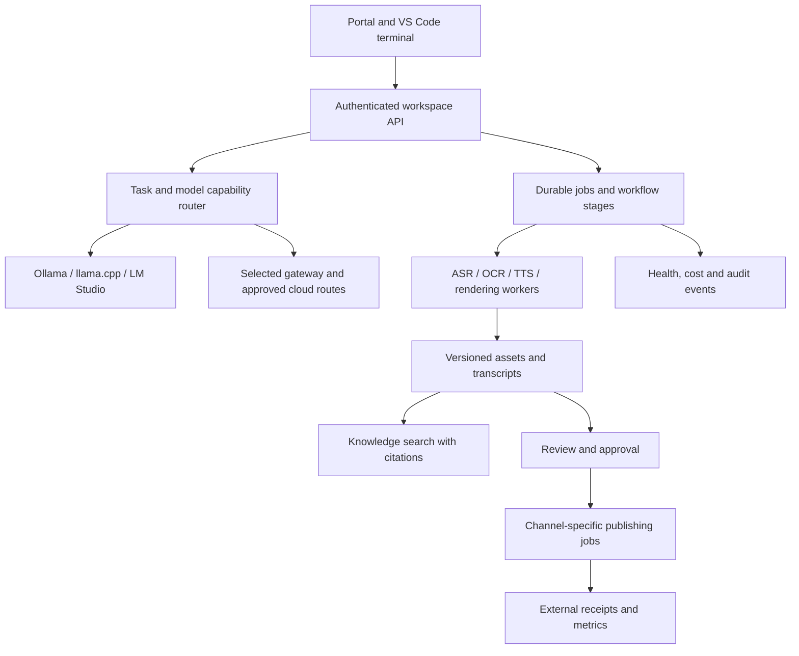

# Advanced AI, media and social platform implementation plan

Date: 2026-09-09. Status: proposed implementation backlog, not a claim of completed integrations.

## 1. Outcome and scope

Extend the existing SohamYoga/PraveenChatbot system into one workspace for local coding, document research, media conversion, video production and social distribution. Users choose a business task; the system selects a verified runtime, shows the input and expected output, tracks progress, and keeps the result editable and traceable.

“All” covers the local platforms discussed in this session, the six proposed gateway/observability tools, the 28 supplied social channels, and YouTube ingestion/publishing. Existing Facebook, Instagram and LinkedIn integrations remain compatibility requirements. This is a planning deliverable; it does not authorize posting, account creation, purchases or deployments.

Three execution modes:

- **Local only:** local inference, transcription and rendering; no cloud model fallback. Internet ingestion/publishing requires separate explicit actions and is unavailable in offline mode.
- **Hybrid:** local default; approved cloud providers may handle tasks that local hardware cannot meet, subject to budget and data policy.
- **Provider selected:** user pins the runtime/model for reproducibility or comparison.

## 2. Evidence-based baseline

| Component | Evidence available | Required advancement |
|---|---|---|
| Ollama 11435 | Local 3B generation and an Aider file edit passed in this session | Stable service ownership, model registry, resource scheduling, tool-use evaluations |
| Ollama 11434 | Separate catalog; an earlier 7B generation timed out | Diagnose and label the duplicate endpoint before consolidating; preserve its consumers |
| llama.cpp 8082/8084 | Both health endpoints passed; 8082 generated code | Friendly model IDs, controlled context/concurrency, latency and tool-use benchmarks |
| LM Studio 8083 | Model listing passed | Real generation and editing tests before calling it production-ready |
| LocalAI | Container was exited during audit | Inspect failure and decide whether its unique capabilities justify restoration |
| OpenClaw 18889 | Explicit Ollama11435 connection; direct local inference passed | Workspace-scoped file/tool execution tests, cancellation, task handoff and limits |
| Aider / ollama-code | Actual file change and three assertions passed | Multi-file evaluation, useful errors, test integration and context management |
| Unified portal 8101 | UI responded; local provider adapters exist | Consolidated task UI, actual capability status and job/artifact tracking |
| Existing LiteLLM 4400 | Model catalog lists fast/code/strong | Generation, auth, routing and failure tests; audit its pre-existing environment |
| New LiteLLM 4000 setup | Disabled after dependency conflict | Do not duplicate the running gateway; reconcile first |
| OmniRoute 20128 | Authenticated cloud-route test passed earlier | Explicit local routes and quota-failure verification; free cloud is not offline |
| Video modules | Source inspection: espeak-ng/FFmpeg renderer and timeline renderer | Durable jobs, richer compositing and scene management; benchmark runtime separately |
| Social modules | Existing schema, content and provisioning source found | Per-account/per-operation verification; do not infer readiness from source files |

Code anchors: `ai-orchestrator-platform/backend/app/providers.py`, `agentic-ollama-platform/`, `sohamyoga-frontend/src/domain/video/VideoRenderer.ts`, `VideoTimelineRenderer.ts`, and `src/domain/social/`.

The inspected timeline implementation uses the first video track and one background-audio clip; caption/text/shape tracks are not yet composited there. The inspected brand-kit lookup selects a default without an explicit tenant predicate; verify isolation before reuse across customers.

Per `decision-ollama-terminal-edit-verified`, the local terminal launcher is an existing tested building block. Per `decision-openclaw-local-verified-20260908`, OpenClaw inference is tested but autonomous editing is not. Earlier provisioning decisions such as `1788216506788-ldipye` identify historical gaps, not current truth; phase 0 rechecks them before opening duplicate tickets.

## 3. Product areas and responsibilities

| Area | User experience | System owner |
|---|---|---|
| Workspace | Project, customer, brand, files, privacy mode and budget | Existing portal + tenant/workspace services |
| Coding Studio | Select files, explain/fix/refactor, see diff, run tests | Aider first; evaluated OpenClaw tools second |
| Media Inbox | Upload files or add authorized source URLs | Asset ingestion service |
| Transcript Studio | Play media beside editable timed text | Transcription and document services |
| Video Studio | Brief, script, storyboard, voice, timeline, preview | Existing video domain extended with workers |
| Knowledge Library | Search documents/transcripts with source timestamps | Existing RAG engine extended with media citations |
| Publishing Calendar | Channel previews, approval, schedule and receipts | Existing social domain and adapters |
| Operations | Queues, runtime health, costs, failures and access tasks | Shared job service + telemetry |

## 4. Use cases, user stories, input, process and output

| ID / priority | Use case and user story | Input | Process | Output |
|---|---|---|---|---|
| UC01 / P0 | As a developer, continue editing when cloud quota ends | Goal, selected files, failing test, local mode | Explicit handoff to local Aider; propose/apply scoped diff; test | Changed files, diff, test report, handoff note |
| UC02 / P1 | As a developer, investigate a multi-file bug | Error, repository subset, reproduction | Build bounded file map; explain cause; edit and validate | Patch, explanation, tests and unresolved risks |
| UC03 / P1 | As an operator, route work to a suitable available model | Task, privacy, budget, latency requirement | Filter capabilities; benchmark-based selection; eligible fallback | Response plus provider/model and routing trace |
| UC04 / P0 | As a researcher, convert video to searchable text | MP4/MOV/WebM, language, optional glossary | Probe; extract audio; VAD; ASR; align; review | TXT, Markdown, JSON segments, SRT and VTT |
| UC05 / P0 | As a creator, convert a YouTube video to text | URL and authorized captions/media access | Fetch allowed captions first; otherwise authorized audio + ASR | Transcript, source URL, timestamps and provenance |
| UC06 / P1 | As a learner, understand a long recording quickly | Transcript and requested summary length | Segment by topic; summarize with timestamp references | Summary, chapters, glossary and key takeaways |
| UC07 / P1 | As a manager, extract decisions from a meeting | Audio/video, vocabulary, speaker information | ASR; optional diarization; extract supported action items | Minutes, decisions, owners/dates where stated, unknowns |
| UC08 / P1 | As a multilingual publisher, translate subtitles | Approved transcript, target language | Translate segments; preserve timing; review names and reading speed | Translated text and subtitle files |
| UC09 / P1 | As a researcher, search across recordings | Question, permitted source library | Retrieve transcript spans; generate cited answer | Answer with source/time links and uncertainty |
| UC10 / P1 | As a learner, capture slides and demonstrations | Video, sampling policy | Scene sampling; OCR; optional vision analysis; align to audio | Visual notes and extracted text with frame timestamps |
| UC11 / P0 | As a marketer, turn text into a finished narrated video | Brief, script, brand kit, duration, aspect ratio | Script review; storyboard; TTS; approved assets; template render | MP4, thumbnail, captions, script and editable project |
| UC12 / P2 | As a producer, generate original motion from a prompt | Scene prompt, references, seed, duration, budget | Select compatible generative workflow; render short scene; QA | Generated clip plus model/workflow/seed metadata |
| UC13 / P2 | As a retailer, animate a supplied product image | Product image, allowed changes, motion brief | Image-to-video workflow; identity/product consistency review | Short clip with provenance and review state |
| UC14 / P1 | As a trainer, convert a document into a lesson video | DOCX/PDF/Markdown, audience, lesson objectives | Extract; outline; cite; storyboard; narration; render | Lesson MP4, slides/notes, quiz draft and source links |
| UC15 / P1 | As an educator, create a screen/code explainer | Code/sample capture, narration and callouts | Capture isolated demo; synchronize highlights and voice | Explainer video and reproducible capture instructions |
| UC16 / P1 | As an editor, repurpose a long recording into shorts | Source video, audience, clip duration | Find candidate spans; human selection; trim/reframe/caption | Reviewed clips in 9:16, 1:1 or 16:9 |
| UC17 / P1 | As a creator, add accessible captions | Video + corrected subtitle track | Style/preview; burn captions or package sidecar | Captioned MP4 and selectable subtitle assets |
| UC18 / P1 | As a producer, create or improve narration | Text or existing voice track, selected voice | TTS or cleanup; normalize; align; duck music | WAV/MP3, timing metadata and mixed video |
| UC19 / P2 | As a publisher, dub a video | Original video, translated script, authorized voice | Fit translation; synthesize; align; mix; review | Dubbed video, transcript and audio stems |
| UC20 / P1 | As a campaign manager, reuse a webinar across channels | Approved video/transcript, goals and brand | Create article, newsletter, posts and clip briefs | Linked campaign asset bundle with drafts |
| UC21 / P1 | As a brand owner, keep outputs consistent | Brand rules, logo, tone, examples | Versioned templates; validation; preview | Consistent channel variants and exceptions report |
| UC22 / P0 | As an admin, connect a channel correctly | Account, permitted scopes, ownership evidence | Guided manual prerequisites; OAuth/token test | Capability-specific readiness and remaining tasks |
| UC23 / P1 | As an editor, approve content before release | Draft, destination, target time | Per-channel preview; approval bound to content hash | Approved immutable publication version |
| UC24 / P1 | As a publisher, schedule without duplicate posts | Approved version, timezone, channel account | Queue; validate; idempotent adapter; reconcile | External post ID/URL, status and attempt history |
| UC25 / P2 | As a community manager, triage messages | Authorized incoming events and topic rules | Verify webhook; deduplicate; classify; draft response | Inbox, response drafts and escalation tasks |
| UC26 / P2 | As a marketer, measure campaign outcomes | Authorized metrics, tagged links, conversions | Normalize by channel; preserve source definitions | Performance dashboard and attribution limitations |
| UC27 / P2 | As a reputation manager, respond to feedback | Permitted review feed, account context | Classify; propose response; approve where required | Review queue, reply draft and supported publication |
| UC28 / P1 | As an operator, recover interrupted media jobs | Job ID and checkpoint | Lease expiry; stage retry; validate existing artifacts | Resumed job without duplicate charge/publication |
| UC29 / P1 | As a customer admin, control data access | Tenant, roles, retention rules | Enforce access on assets/jobs/search/export; audit | Isolated workspace, retention and deletion evidence |
| UC30 / P2 | As a platform owner, evaluate routing quality | Fixed task corpus and model candidates | Paired task runs; quality/cost/latency scoring | Reproducible benchmark and deployment decision |

## 5. Detailed priority workflows

### Video to text

1. Accept resumable upload with a checksum and workspace ownership. Proposed initial product limits: 2 GB and 120 minutes, configurable after load tests.
2. `ffprobe` checks actual type, duration and streams; reject unsupported/corrupt files explicitly.
3. Extract audio and segment it using voice activity detection. Run faster-whisper or whisper.cpp after a compatibility benchmark; preserve original timestamps.
4. Add optional speaker diarization as a separate stage. A speaker label is not a verified identity. ASR confidence is a review hint, not a calibrated accuracy guarantee.
5. Store immutable raw transcript plus versioned user corrections. Silent video produces “no speech detected”; visual OCR/description is a separately requested task.
6. Let users edit text while listening to the matching segment. Regenerate dependent summaries/subtitles from the selected revision.
7. Export TXT/MD/JSON/SRT/VTT with provenance. Summaries reference timestamp spans and do not invent inaudible words.

Acceptance: a 10-minute reference fixture produces monotonic timestamps inside media duration, valid subtitle files and a correct artifact manifest. Test silence, music, noisy speech, code-switching and interrupted upload. Initial proposed quality gate: <=15% word error rate on a clean, hand-transcribed domain test set; report noisy/language subsets separately and revise target from baseline evidence.

### YouTube to text

1. Validate/canonicalize the URL; protect the fetcher against private-network redirects and unrestricted downloads.
2. For owned/managed videos, use authorized caption access where available. YouTube's captions download API requires sufficient permissions; a public URL alone does not establish API access.
3. For other permitted sources, use an approved retrieval method. If captions/media cannot be accessed legitimately, request an upload or show a blocked prerequisite rather than an endless retry.
4. Normalize caption timing or transcribe permitted audio. Save video ID, language, access method, fetched time and checksum.
5. Offer transcript, timestamped summary, chapters, Q&A and a content-repurposing draft.

Acceptance: cover owned-caption success, no-caption ASR success using permitted media, unavailable/private video, denied access, duplicate URL and a changed caption revision. No generated transcript is labeled as the video's original captions.

### Text to video

**Track A: predictable production first.** Brief -> outline -> approved script -> timed scenes -> licensed/supplied/generated stills -> narration -> timeline -> captions -> preview -> final encoding. Extend the existing FFmpeg and timeline modules; preserve an editable scene/timeline document. Optional motion-composition adapters can be evaluated without replacing the renderer contract.

**Track B: generative motion second.** Generate short scenes through a versioned ComfyUI-compatible workflow or an approved external service, then assemble them through Track A. A model's ability to generate text does not make it a video model. Label generated scenes and retain references, workflow version, seed and retries. Character/product consistency remains a review criterion, not a guaranteed feature.

Acceptance: Track A renders a 60-second fixture in 16:9 and 9:16 with readable captions, no missing assets, validated audio/video streams and target duration within one second. Track B must first pass a short clip benchmark on compatible hardware; do not promise real-time or high-resolution generation on the current GTX1080Ti.

### Local coding after cloud quota exhaustion

Quota error -> save a handoff containing goal/files/diff/tests/next step -> user starts or selects a local coding session -> model receives a bounded file set -> edit -> tests -> review. Add a future explicit “Continue locally” action to the portal. Distinguish rate-limit retry, exhausted credit/quota, context overflow and unreachable runtime: each has a different response. No router can silently replace the backend of a cloud-only extension without supported client configuration.

Acceptance: simulate cloud429/quota errors and prove the selected local route succeeds without any cloud-model call. A repeat request must not repeat filesystem writes or other side effects blindly. Local-only mode must fail visibly when no compatible local model is available.

## 6. Social channels: complete rollout inventory

All rows below are requested backlog, not verified API entitlements. “Automate” means only the operation explicitly supported by an account's current authorized integration. Every connector gets its own source-checked capability sheet, scopes, terms/version date, limits, sandbox tests and manual fallback before release. The user's priority labels determine discovery order; they do not certify automation availability.

| Channel | Priority | User story and input | Process to implement | Output / prerequisite gate |
|---|---|---|---|---|
| TikTok | Red | Marketer supplies approved short clip | Validate format; approved publishing adapter | Post receipt or export; account/developer/OAuth approval |
| Pinterest | Red | Retailer supplies image/video, link, board | Generate pin variant; validate; publish where authorized | Pin ID/URL; business/developer access |
| Reddit | Red | Researcher/community lead supplies topic or answer draft | Research permitted data; subreddit review; approved action | Research brief or reviewed post; API authorization |
| WhatsApp Business | Red | Support team supplies opted-in recipient and approved message | Check messaging eligibility/template; send; reconcile | Delivery state; business/number verification and applicable consent |
| Telegram | Red | Admin supplies channel and content | Bot authorization; preview; send; process receipt | Message ID; bot/channel permissions |
| Threads | Orange | Brand editor supplies short post/media | Validate authorized capabilities; schedule | Post receipt; Meta/Threads setup |
| Snapchat | Orange | Campaign editor supplies visual asset | Verify exact business/API surface; export if unsupported | Supported publication/ad operation or export bundle |
| Discord | Orange | Community admin supplies channel/event/message | Bot permission check; rate-limited action | Message/event receipt; server authorization |
| Twitch | Orange | Creator supplies live schedule or stream asset | Separate supported metadata/events from streaming ingest | Schedule/event status or prepared stream package; OAuth |
| Medium | Orange | Author supplies approved article | Verify account integration availability; otherwise export | Article package or supported receipt; publication access |
| Substack | Orange | Publisher supplies newsletter | Prepare edition/assets; supported integration or manual handoff | Newsletter package and recorded publication URL |
| Quora | Orange | Expert supplies question and evidence | Draft answer; human review/manual publication | Answer draft and source notes; no assumed posting API |
| Tumblr | Yellow | Creator supplies text/image/GIF | App authorization; format validation; supported post | Post receipt; API permission |
| Mastodon | Yellow | Editor supplies post/media and instance | Discover instance limits; authorize; publish | Status ID/URL; instance account/app |
| Bluesky | Yellow | Editor supplies post/media | Authorize account; validate rich text/media; post | Record URI/URL; app authorization |
| GitHub | Yellow | Developer supplies approved release/docs | Generate reviewed release notes/docs; scoped API action | Release/PR URL; org/app/token permissions |
| GitLab | Yellow | Developer supplies release/docs | Reviewed content; scoped project API action | Release/MR URL; project token |
| Stack Overflow | Yellow | Expert supplies a real technical question | Research and draft useful answer; manual review | Answer draft; no bulk marketing automation |
| Google Business Profile | Yellow | Local owner supplies update/photo | Verify ownership and allowed API operation | Supported update receipt or manual task |
| Yelp | Yellow | Owner supplies review/business context | Ingest only authorized data; draft response | Review task/export; business claim/API availability |
| Tripadvisor | Yellow | Hospitality team supplies review/photos | Verify partner/account capability; review workflow | Supported operation or manual handoff |
| Trustpilot | Yellow | Support team supplies review/invitation context | Verify integration entitlement and operation; reconcile | Review/invitation/reply status where supported |
| Vimeo | Yellow | Producer supplies final video and metadata | Resumable upload; processing-status polling | Video ID/URL; account/API entitlement |
| Dailymotion | Yellow | Producer supplies final video | Verify upload access; upload/poll | Video receipt; developer/API access |
| Spotify | Yellow | Podcaster supplies episode/audio/metadata | Publish through eligible hosting/RSS/distribution workflow | Episode/feed validation; creator setup, no assumed audio-upload Web API |
| Apple Podcasts | Yellow | Podcaster supplies feed/episode | Validate hosting/RSS and directory setup | Feed/episode distribution status; creator approval |
| SoundCloud | Yellow | Creator supplies audio/metadata | Verify current API/account upload eligibility | Upload receipt or export package |
| Patreon | Yellow | Creator supplies member content/tier | Verify supported creator operation; reviewed distribution | Supported receipt or manual publishing task |
| YouTube (additional) | Core | Creator supplies owned video/captions | Authorized upload/caption workflow; resumable processing | Video/caption IDs; channel OAuth and required scopes |

Each publication is a separate record. Partial success across channels remains partial; it never marks an entire campaign fully published. UI states distinguish account_connected, operation_authorized, tested, ready and blocked, per operation.

## 7. Architecture and platform roles

One API contract and shared artifact/job model; do not chain every gateway on every request.

| Platform | Planned advanced role | Release decision |
|---|---|---|
| Ollama | Default managed local model service | Reuse11435, benchmark model loading and tool behavior |
| llama.cpp | Tuned GGUF inference and constrained-memory profiles | Reuse existing servers; alias and measure |
| LM Studio | Interactive local inference/model management | Verify generation before advertising as equivalent |
| LocalAI | Optional additional local API capabilities | Restore only after failure/overlap audit |
| Aider | Primary tested terminal file editor | Extend existing launcher and tests |
| OpenClaw | Multi-step workspace automation | Add least-privilege tool policies and real task tests |
| LiteLLM | Candidate central provider normalization/routing | Audit existing4400; avoid second deployment |
| OmniRoute | Candidate alternative gateway and provider access | Independent adapter and fallback evaluation |
| Higress | Candidate ingress, authentication and rate-policy layer | Deploy only for an identified ingress need |
| Helicone | Candidate request tracing/cost observability | Evaluate logging redaction, retention and storage footprint |
| Bifrost | Candidate low-overhead gateway | Benchmark against existing gateway, use as alternative |
| Portkey OSS gateway | Candidate alternate gateway/policy adapter | Verify OSS capabilities separately from hosted features |
| RouteLLM | Optional learned strong/weak routing | Needs evaluated model pair, calibrated threshold and compatible embedding/router setup |

Provide a lab profile and connector contract for every requested platform, but select one primary request route by evidence. Gateway comparison uses identical tasks, concurrency, model endpoints and logging settings. Publish quality, p50/p95 latency, memory, failure rate and operational complexity rather than assuming a brand is faster.

## 8. Shared data, APIs and job semantics

Reuse existing tenant/project/content/video tables where possible. Proposed additions or extensions:

- `ai_runtime`, `model_capability`, `model_benchmark`, `routing_policy_version`.
- `media_asset` with tenant, source, checksum, MIME, duration, storage URI, provenance and retention.
- `workflow_run`, `job_stage`, `job_attempt`, `resource_lease`, `artifact_manifest`.
- `transcript`, `transcript_revision`, `transcript_segment`, `source_citation`.
- `storyboard`, `scene`, `timeline_revision`, `render_profile`, `voice_asset`.
- `channel_capability`, `connection_verification`, `publication_version`, `approval`, `publish_attempt`, `external_receipt`.
- `evaluation_run`, `cost_event`, `audit_event` with minimal/redacted payloads.

Proposed APIs: `POST /media/uploads`, `POST /media/youtube-imports`, `POST /transcription-jobs`, `PATCH /transcripts/{id}`, `POST /video-projects`, `POST /video-projects/{id}/renders`, `GET /jobs/{id}`, `GET /jobs/{id}/events`, `POST /jobs/{id}/cancel`, `POST /jobs/{id}/retry`, `GET /runtimes/capabilities`, `POST /publications/{id}/approve`, `POST /publications/{id}/schedule`. Prefix and ownership must follow existing repository API conventions during implementation.

Jobs move through accepted -> validating -> queued -> running -> review_required -> succeeded, with explicit blocked/failed/cancelled branches. Store progress by real stage rather than simulated percentages. Durable worker leases, heartbeats, bounded retries, dead-letter inspection and atomic artifact finalization support recovery. Use an outbox for publication; reconcile ambiguous external timeouts before retrying.

## 9. Capacity, security and operations

Observed host: GTX1080Ti with11GB VRAM,31GiB RAM and substantial swap pressure during the audit. This is a shared machine. Begin with one heavy GPU job at a time; allow lightweight CPU/I/O work independently. Admission control checks free memory, active interactive work and estimated model footprint. Do not kill unrelated processes or evict actively used models automatically.

Queue interactive coding above batch rendering; expose queue position and a cancel action. Benchmark CPU-int8 transcription and compatible GPU inference separately. Keep model files and media on the large data disk, with quotas and cleanup policies. Generative video gets a hardware feasibility gate, not an assumed performance target. Docker isolation does not resolve insufficient memory or GPU incompatibility.

Use the canonical `/home/praveen/venv-ardupilot` policy for shell work. Verify dependencies before installation. Incompatible runtime isolation remains an explicit environment decision; prior requests to approve container exceptions are not treated as approved by this plan.

Enforce tenant checks on every lookup and artifact download; keep raw private media outside public web roots. Validate media types and path boundaries, use bounded subprocesses, and prevent URL fetches into internal services. Store provider secrets by reference, verify webhook signatures, redact traces and cap retained transcripts. Content fetched from videos/documents is data, not authorization to run tools. Publication approval is tied to the exact content and destination; changed content invalidates approval.

Existing Docker idle policy continues: application stacks stop as units after qualifying idle windows; protected services remain protected. Account for active jobs and model requests when establishing whether a new service can safely idle.

## 10. Delivery phases and acceptance gates

Estimates are planning ranges for two engineers plus shared QA/content operations, not commitments. Account approvals and hardware procurement can extend calendar time independently. Re-estimate after phase0; some tracks can overlap.

| Phase | Approximate effort | Deliverables | Exit gate |
|---|---|---|---|
| 0: Reconcile and benchmark | 3–5 working days | Runtime/source inventory, service ownership, channel capability register, baseline corpus, ADRs | Every capability labeled verified/partial/blocked; no duplicate task based only on stale memory |
| 1: Reliable local foundation | 1–2 weeks | Runtime registry, model profiles, health probes, local handoff, durable queue, resource admission | Local coding task succeeds during simulated cloud quota outage; cancelled/restarted jobs behave correctly |
| 2: Media ingestion and transcripts | 2–3 weeks | Uploads, authorized YouTube import, ASR, transcript editor, exports, summaries/search | Golden media fixtures and access/failure cases pass; citation/timing evidence retained |
| 3: Template video studio | 2–3 weeks | Script/storyboard, TTS, assets, multitrack timeline, captions, preview and rendering | Validated60-second outputs in two aspect ratios; exact approved revision is rendered |
| 4: Channel operations | 2–4 weeks plus access lead time | Connection prerequisites, draft variants, approval/scheduling, first authorized connector wave | A test account publishes once, receives external receipt and survives retry without duplication |
| 5: Advanced routing and generation | 3–5 weeks | Gateway comparison, optional learned routing, generative scene pilot, dubbing and repurposing | Quality/cost benchmark passes; hardware feasibility demonstrated; no silent cloud use |
| 6: Remaining channels and hardening | 2–4 weeks plus access lead time | All remaining capability sheets/adapters or honest manual exports, tenant/load/restore tests | Full workflow demonstrable; unsupported operations are visible, not simulated |

Critical path: reliable jobs/storage -> transcription -> reusable media assets -> video production -> approved channel distribution. Start developer/OAuth applications during phase0 to avoid waiting until publishing is implemented.

First ten implementation tickets:

1. Audit runtime endpoints and their service owners; reconcile11434/11435 and both LiteLLM installs.
2. Add real readiness probes including generation and tool-call fixtures; record benchmark timestamps.
3. Design migrations for asset provenance and leased media jobs, mapped to existing tables.
4. Implement resumable upload, checksum deduplication and private asset delivery.
5. Implement ASR worker with CPU fallback, timestamps, cancellation and durable outputs.
6. Implement transcript review and TXT/MD/JSON/SRT/VTT export.
7. Implement authorized YouTube caption/import workflow with explicit blocked states.
8. Extend storyboard/timeline rendering and close tenant-isolation gaps before reuse.
9. Add immutable approval versions and publication outbox with external reconciliation.
10. Validate first eligible channel end to end; apply the adapter contract to the remaining28-channel backlog.

## 11. Definition of done and evaluation

- A capability is complete only with working UI/API, persisted state, permissions, failure behavior, real artifact/external receipt and a reproducible test.
- Coding corpus: small bug fix, refactor, test creation, multi-file change and malformed tool output. Compare model tiers on tests passed; never rank on answer fluency alone.
- Media corpus: short/long, silent, noisy, multilingual, portrait/landscape, corrupted input and missing audio. Record quality and runtime by input class.
- Reliability tests: worker crash, duplicate submission, disk full, unavailable GPU, expired token,429, partial publication and ambiguous timeout.
- Security tests: cross-tenant asset access, URL SSRF, path traversal, webhook forgery and untrusted transcript instructions.
- Proposed operational goals after capacity baseline: job creation p95<1second excluding upload; progress events within5seconds of stage changes; zero duplicate publications in replay tests; zero cross-tenant leaks in the test suite. Inference/render SLAs are set only after the phase0 benchmark.
- Cost reporting separates cloud spend, estimated local compute/electricity, and human review. Local inference avoids cloud token quotas but is not unlimited capacity.
- Restore test proves database records and artifact checksums remain aligned. Each deploy has a migration rollback strategy and version-pinned model/workflow references.

## 12. Sources and implementation research gates

- [faster-whisper](https://github.com/SYSTRAN/faster-whisper): candidate ASR runtime; benchmark its CUDA/CTranslate2 requirements against this host before choosing GPU mode.
- [yt-dlp](https://github.com/yt-dlp/yt-dlp): optional permitted-media retrieval adapter; pin and maintain separately from the job contract.
- [YouTube captions download](https://developers.google.com/youtube/v3/docs/captions/download): authorization/access gate for caption retrieval.
- [ComfyUI Wan2.2 workflows](https://docs.comfy.org/tutorials/video/wan/wan2_2): candidate generative-video research track; these docs are not proof the current GPU meets a chosen workflow's requirements.
- [Aider Ollama integration](https://aider.chat/docs/llms/ollama.html) and [OpenClaw Ollama provider](https://docs.openclaw.ai/providers/ollama): existing local coding/orchestration integration contracts.

All social endpoint/scoping claims require fresh primary-documentation verification in their connector ticket. Publish the verification date and supported operations in the product. Do not carry the supplied “high automation” ratings forward as implementation evidence.

## 13. Expanded scope: single-window marketing and media operations

User expansion includes LinkedIn posting, classified listings, customer response tracking, reels, audio/video integration, CapCut, third-party editors, Higgsfield, educational AR, Doodly, labels/tags, After Effects, text/image overlays, messages, alerts and background editing. “aode vidoe” is interpreted as audio/video, “cupcat” as CapCut, and “doddly” as Doodly. These extensions are part of the same plan; sections1–12 remain applicable.

### Single-window layout

One customer/workspace selector governs all views. Preserve current tenant identity when moving between content, conversations and outcomes.

| View | Main controls | What the user can monitor |
|---|---|---|
| Overview | Customer, campaign, owner, date range, channel filters | Queued jobs, failed posts, unanswered inquiries, expiring listings, approval workload |
| Content and listings | Master asset, listing fields, channel-specific variants | Draft/approved/live/expired/sold state per destination |
| Calendar | Timeline, channel preview, local-time display | Scheduled posts, reels, renewals and reminders |
| Unified inbox | Conversation, original channel, listing/post link, owner | New, assigned, waiting, replied, resolved, spam and SLA state |
| Reel and video studio | Script, media bin, timeline, subtitles, editor handoff | Scene versions, render progress, quality checks and published variants |
| Learning studio | Lesson objectives, labels, AR preview, quiz | Learning artifacts, interaction/assessment evidence and review state |
| Analytics | Source, metric definition, data freshness, campaign links | Engagement, inquiries, response time, leads, bookings and attributed outcomes |
| Connections and tasks | Permissions, auth renewal, manual prerequisites | Ready actions, blocked actions, stale syncs and required human work |

An unsupported metric is `not_available`, not zero. “Last synchronized” and “last externally confirmed” are separate timestamps. A green connection does not imply posting, messaging and analytics are all supported. Human-completed tasks can be recorded centrally, but must remain visibly manual.

### Additional use cases and user stories

| ID / priority | Use case and user story | Input | Process | Output |
|---|---|---|---|---|
| UC31 / P1 | As a B2B marketer, publish LinkedIn content | Approved text, image/video/document, member/page destination | Check product access/scopes; upload media; create post; reconcile | LinkedIn post identifier, URL and per-action status |
| UC32 / P1 | As a seller, prepare one listing for multiple portals | Title, description, price, category, location, images, stock | Validate master listing; map portal fields; preview differences | Ready variants, unsupported-field warnings and posting tasks |
| UC33 / P2 | As a seller, manage the complete listing lifecycle | Listing and external IDs, availability, expiry policy | Publish/update/close where authorized; track manual changes otherwise | Accurate live/expired/sold status and renewal reminders |
| UC34 / P1 | As a service team, answer inquiries from one screen | Authorized webhooks/API events or explicit manual imports | Normalize thread; link source post/listing; assign; draft response | Unified conversation, owner, reply history and next action |
| UC35 / P1 | As a manager, prevent missed customer responses | SLA by channel, business hours, owner | Calculate deadline; alert; escalate; record acknowledgment | Overdue queue, notification and response-time report |
| UC36 / P2 | As a sales lead, track inquiry to conversion | Conversation, consented contact, offer/booking outcome | Create/link CRM lead; retain source evidence; update stage | Lead timeline and attributed outcome with confidence |
| UC37 / P1 | As an editor, manage reels as reusable assets | Source video, hooks, CTA, language, target channels | Candidate clips; edit variants; review safe zones; schedule | Reel family with parent source, versions and receipts |
| UC38 / P1 | As a creator, continue editing in CapCut | Clip bundle, music/voice stems, captions and edit instructions | Export supported assets; editor task; ingest returned render | Versioned final video and handoff manifest |
| UC39 / P2 | As a designer, render branded After Effects templates | Validated template, text/image replacements, render settings | Dedicated licensed worker; scripted substitutions; aerender; QA | Motion graphic/video and template/job metadata |
| UC40 / P2 | As a producer, generate a Higgsfield scene | Prompt, approved references, chosen model, cost cap | Validate API entitlement; submit once; poll/callback; fetch output | Scene clip/image, provider job ID, cost and review state |
| UC41 / P2 | As an educator, create a Doodly whiteboard lesson | Storyboard, narration, drawings and timing notes | Export editor package; manual authoring unless vendor API verified; import render | Whiteboard video, source bundle and revision link |
| UC42 / P2 | As a learner, explore an educational AR object | Reviewed GLB/glTF model, lesson, scale, hotspots | Optimize model; present AR on supported device; supply3D fallback | Interactive lesson, annotations and interaction events |
| UC43 / P1 | As an educator, label parts and steps in video | Timed labels, definitions, bounding boxes/anchor points | Place overlays; validate timing/occlusion; preview; render | Labeled educational video and editable annotation track |
| UC44 / P1 | As an editor, add text and images to video | Text, logo/image, font, style, start/end time | Compose layers; keyframe where supported; enforce safe areas | Branded video and reusable overlay preset |
| UC45 / P2 | As an editor, remove or replace backgrounds | Source media, mask or segmentation choice, replacement | Segment/key; inspect edge quality; composite; correct manually | Foreground asset/matte and reviewed composite |
| UC46 / P1 | As a producer, control audio quality | Voice/music/SFX clips, gains and timings | Trim; align; denoise; duck; normalize; check clipping | Mixed master and separate audio stems |
| UC47 / P1 | As a content manager, find assets by labels/tags | Taxonomy, campaign, topic, rights, language, source | Apply controlled tags plus editable AI suggestions | Searchable library, usage lineage and expiration alerts |
| UC48 / P1 | As an operator, receive useful alerts | Job/channel events and notification preferences | Deduplicate; severity route; acknowledge; escalate | In-app alert and enabled email/push delivery evidence |
| UC49 / P2 | As a reviewer, give frame-specific feedback | Preview, timestamp/frame, comment, assignee | Version-bound comments; edit request; resolve with new revision | Review history, resolution evidence and approved version |
| UC50 / P2 | As a teacher, assemble an interactive learning module | Video, transcript, AR object, questions, objectives | Package accessible lesson; assessment rules; LMS adapter | Web lesson and optional validated LMS package/report |

## 14. LinkedIn and classified portal integration backlog

### LinkedIn workflow

Implement member posting and organization posting as separate capabilities, with their own permitted scopes and account prerequisites. The official Posts API is the integration starting point. Existing Postiz/LinkedIn code must be audited first so this plan extends it rather than creating a competing publisher.

Draft -> media processing -> exact-destination preview -> approval -> scheduled job -> create/reconcile external post -> metrics/comments where authorized -> CRM source linkage. Do not assume access to member inboxes, connection invitations, private messages or every comment feed from permission to publish a post. Unsupported inbox activity becomes a user-created follow-up task with a deep link, not an automated collection claim.

Acceptance: one authorized test post receives an external ID; replay cannot duplicate it; expired OAuth creates a reconnect task; a failed upload never produces a false published state. Version and scope requirements are tracked against [LinkedIn's Posts API documentation](https://learn.microsoft.com/en-au/linkedin/marketing/community-management/shares/posts-api?view=li-lms-2026-03).

### Classified and marketplace candidates

Canada-first candidate list below. Marketplaces and vertical portals are distinguished from general classifieds. Geographic fit, current availability and account entitlements must be verified before activation; this is a discovery backlog, not a promise of APIs.

| Portal | Intended fit | Initial integration mode | Required proof before automation |
|---|---|---|---|
| Kijiji | Canada general goods/services/categories | Listing package + tracked manual publication; authorized partner integration if obtained | Written/API/partner authority for the exact operation; no general API assumed |
| Kijiji Autos | Vehicle/dealer listings | Dealer workflow discovery | Dealer account and approved feed/partner entitlement |
| Craigslist | Local classifieds in supported markets | Manual handoff or eligible bulk interface | Category/account eligibility for official bulk posting |
| Facebook Marketplace | Local commerce | Manual package by default | Explicit eligible business/partner integration; Page posting is not Marketplace access |
| Used.ca | Canadian local classifieds | Manual/export until capability verified | Current portal coverage, vendor permission and available feed/API |
| LesPAC | Quebec classifieds | French/English listing packages | Current vendor integration and account access |
| eBay | Marketplace inventory, not generic classifieds | Official inventory/offer workflow for eligible sellers | Developer keys, seller OAuth, business policies and category/site eligibility |
| AutoTrader.ca | Vehicle marketplace | Dealer-feed discovery | Dealer/partner agreement and exact inventory-feed specification |
| Rentfaster.ca | Rental listings | Manual/partner discovery | Property/account eligibility and supported integration |
| Rentals.ca | Rental marketplace | Manual/partner discovery | Approved property/feed relationship |
| Gumtree | Geographic expansion candidate | Discovery/manual package | Active target market, account and vendor-approved capability |
| OLX / dubizzle | Geographic expansion candidates | Country-specific discovery | Correct regional operator, listing category and approved integration |

The official [Craigslist bulk interface](https://www.craigslist.org/about/bulk_posting_interface) and [eBay Inventory API](https://developer.ebay.com/api-docs/sell/inventory/static/overview.html) establish possible integration paths, not universal access. [Kijiji's terms](https://community.kijiji.ca/t/kijiji-terms-of-use/29) make permission relevant to automated access; the adapter remains disabled until the account's allowed workflow is confirmed. [LesPAC](https://www.lespac.com/ca/) is a regional discovery candidate. Remaining candidates require primary-source review in their individual tickets.

Master listing data: tenant, seller, listing type, category mapping, condition, price/currency, location/service area, availability, inventory quantity, photos/video, rights, contact method, external listing IDs, expiry, tags and campaign. Each portal variant records overrides and required fields. Category-specific rules prevent irrelevant ads, duplicate-location spam and accidental vehicle/property field reuse.

Lifecycle: draft -> validated -> approval_required -> scheduled/manual_task -> published -> updated/expired/sold/withdrawn. Map external state separately from internal state. An inventory change creates a reconciliation task for every destination; unsupported update APIs stay explicit manual tasks. Store the external link plus publication evidence for manual destinations.

## 15. Customer response tracking and alerts

Event ingestion supports signed webhooks, permitted polling, authorized mailbox imports where suitable, and manual records. Each connector declares which sources actually exist. Do not assume classified portals expose messages simply because a listing can be posted.

Normalize to `conversation`, `message`, `participant`, `source_object`, `assignment`, `sla_clock`, `reply_draft`, `delivery_receipt` and `crm_link`. Preserve original external IDs and timestamps. Deduplicate by provider/account/event ID; handle delayed, edited and deleted events. Automatically suggest duplicate contacts but require evidence or human confirmation before merging identities across channels.

Inbox actions: assign, tag, internal note, draft reply, approve/send where supported, open original thread, set follow-up, link booking, close and reopen. Require business-hours/timezone-aware SLAs; pause timers only for documented states. A drafted reply is not a sent reply, and an API-accepted reply is not necessarily delivered/read.

Alerts: publishing failure, token expiry, response deadline, negative-feedback escalation, render failure, storage/memory threshold, unavailable source, listing expiry and depleted approved cloud budget. Deduplicate alerts, support quiet hours, escalation owner and acknowledgment. The dashboard remains the source of truth if external email/push delivery fails.

Acceptance: replay a webhook without duplicate messages; detect an overdue response; preserve threading after out-of-order events; show an unsupported messaging action disabled; maintain tenant isolation; trace an inquiry back to its exact post/listing version. Measure response time only for channels with adequate event coverage.

## 16. Third-party editor and generation integration contract

| Tool / family | Planned integration | Capability boundary / prerequisite |
|---|---|---|
| CapCut | Supported file export/import: media, SRT, stems, brief and returned MP4 | Public editing API not verified in this research; do not generate undocumented proprietary project files |
| Adobe After Effects | Versioned templates + documented scripting/render worker | Licensed supported Windows/macOS worker and compatible fonts/plugins; Linux portal orchestrates the job |
| Adobe Premiere Pro | Editorial handoff and supported interchange investigation | Validate chosen interchange format/version; no assumed lossless timeline conversion |
| DaVinci Resolve | Supported project/interchange handoff; scripting proof of concept | Verify installed edition/version, scripting API availability and export behavior |
| Blender | Scriptable educational3D/animation render worker | Pin Blender version, scene dependencies and GPU/CPU profile |
| Kdenlive / Shotcut | Local editing handoff and validated project/export workflow | Verify format support; preserve original source and final render separately |
| Doodly | Storyboard/assets/narration package and exported-video ingestion | No public authoring API verified; licensed desktop/manual authoring path first |
| Higgsfield | Official API adapter for entitled models and operations | Credentials, per-model schema, quota/cost cap, async lifecycle; app features are not automatically API features |
| ComfyUI | Versioned workflow submission and artifact retrieval | Pinned nodes/model licenses, compatible machine and benchmark |
| FFmpeg / motion composition | First-party repeatable editing/compositing | Shared timeline contract, deterministic asset paths and render tests |

Use `editor_handoff` records containing manifest version, original project revision, tool/version, assets with checksums, edit instructions, expected output format, owner, due date and returned artifact. States: prepared -> exported -> in_editor -> returned -> validated -> accepted. Never mark an exported package as a completed edit.

Automation adapters expose `capabilities`, `validate`, `submit`, `status`, `cancel` where supported, and `collectArtifacts`. A tool that cannot cancel must say so. Async provider requests store the provider job ID before retry decisions; a timeout must not submit a second billable generation without reconciliation.

After Effects templates expose an allowlist of text/image/color controls; no arbitrary user script execution. Render workers validate dependencies and use temporary workspaces. Adobe documents [scripted automation](https://helpx.adobe.com/after-effects/desktop/automate-in-after-effects/automate-animation/automation.html) and [aerender](https://helpx.adobe.com/after-effects/desktop/render-and-export/automate-rendering/automated-rendering-network-rendering.html). Higgsfield's official entry point is [API documentation](https://docs.higgsfield.ai/docs). Doodly supports [video export](https://support.voomly.com/en/articles/12735833-doodly-exporting-your-doodly-videos); this supports a handoff design, not an inferred authoring API.

## 17. Advanced editing and educational AR

### Common editable timeline

Extend the existing timeline to multiple video, audio, image, text, caption, annotation and effect tracks. Each item stores source trim, timeline start/duration, transform, opacity, style, keyframes and stable asset ID. Use milliseconds or explicit rational frame rates consistently; preserve source frame rate and avoid cumulative rounding drift.

Features delivered incrementally:

1. Trim/split/reorder, crop/reframe, background audio, fades and validated exports.
2. Text-on-video, logos/images, lower thirds, step labels, highlights and caption tracks.
3. Multiple audio clips, voice/music ducking, noise cleanup and loudness checks.
4. Background replacement, keying/segmentation, masks and manual edge correction.
5. Tracked annotations, motion presets, reusable brand templates and third-party render adapters.

Separate metadata tags from visible labels. Tags include topic, campaign, language, curriculum objective, rights/expiry, product, audience and review status. Visible labels include timed callouts, part names, step numbers and warnings. AI-generated tags remain editable suggestions. Labels require readable contrast, safe positioning and preview on the smallest target device.

### Education workflow

Learning objective -> sourced lesson outline -> educator review -> visual plan -> narration/captions -> video and/or interactive3D scene -> labels/hotspots -> formative questions -> accessible preview -> publication -> learning-event reporting.

AR scenes use reviewed GLB/glTF assets, meaningful scale, named objects, hotspot descriptions and a defined learning objective. Prototype with Three.js and/or [model-viewer](https://modelviewer.dev/docs/index.html); supported devices enter AR, others retain an interactive3D or video fallback. An MP4 is a recording, not interactive AR. Export AR objects and video as separate linked artifacts.

Example educational journeys:

- Yoga anatomy: rotate a reviewed anatomical model, select muscles, view labels and a short explanatory video; instructor reviews alignment/safety statements.
- Science lesson: explore an annotated model, play an explanation, answer a question and revisit the relevant segment.
- Product training: identify component labels, watch a procedural reel and complete a task checklist.
- Coding lesson: inspect a code example, watch highlighted execution and attempt an exercise; assessment checks actual output.

LMS adapters are separate capabilities: web embed first, then a tested SCORM/xAPI/LTI path according to the target LMS. Completion and learning outcomes come from explicit events/assessment, not guessed from video publication. Caption transcripts, keyboard navigation, text equivalents and reduced-motion alternatives are release requirements.

## 18. Revised rollout for the expanded scope

The previous phase estimates excluded the full classifieds/editor/AR expansion. Do not treat them as a commitment for this larger plan. A provisional envelope is16–24 weeks for a small cross-functional team after discovery, with vendor access and specialist hardware potentially extending the schedule. Re-estimate per workstream after capability audits; a manual-handoff implementation can ship much earlier than a vendor API partnership.

| Workstream | Delivery order | Concrete acceptance example |
|---|---|---|
| Single-window foundation | First, alongside local/media reliability | Workspace filters apply to jobs, content and inbox without cross-tenant leakage |
| LinkedIn and channel posting | Early eligible connector wave | Real authorized post ID, reconnect flow and duplicate prevention |
| Classified listings | Master listing + Kijiji handoff first; entitled APIs next | One master produces validated variants; manual evidence and API receipts remain distinguishable |
| Customer response tracking | First supported webhook/message source, then expand | Incoming inquiry links to source content, assigns owner and triggers an SLA alert |
| Reel/overlay/audio editing | After basic timeline rendering | One source yields reviewed captioned reels with correct voice/music mix |
| CapCut/Doodly handoffs | Early file-based integration | Exported bundle returns as validated artifact tied to the original revision |
| Higgsfield and After Effects | After credentials/worker readiness | One async scene/template job completes with provenance, cost and recoverable state |
| Educational AR | Reviewed pilot lesson before reusable authoring | AR interaction on supported device plus accessible fallback and learning events |

Additional backlog tickets: unified inbox schema; event deduplication; assignment/SLA; classified category mapper; listing lifecycle reconciliation; editor handoff manifest; overlay tracks; multitrack audio; segmentation review; scene annotation; frame comments; Higgsfield adapter; After Effects worker; learning-event schema; AR pilot; LMS compatibility test.

Completion demonstration: a permitted source recording becomes a corrected transcript, an educational video with labels/captions, a reel, a LinkedIn draft and classified campaign assets. A reviewer approves appropriate destinations; supported posts produce receipts, manual destinations produce tracked tasks; an authorized inquiry appears in the inbox and links to CRM. A linked AR lesson works on a supported device with a fallback. Every stage shows provenance, actual status and unresolved prerequisites.
